# RK3506主板

旨在开发者快速熟悉使用该产品。

##  1. 硬件清单

- 贝启RK3506工业控制主板
- 12V DC电源
- 双头USB数据线
- 串口小板

## 2. PC环境配置

我们会提供驱动安装包以及烧录工具包、以及烧录固件

下载方式：联系我们公司客服获取

下载完成后解压。

### 	2.1 ADB工具安装

adb的工具在bin目录下，打开系统设置环境变量到该目录即可使用adb工具。

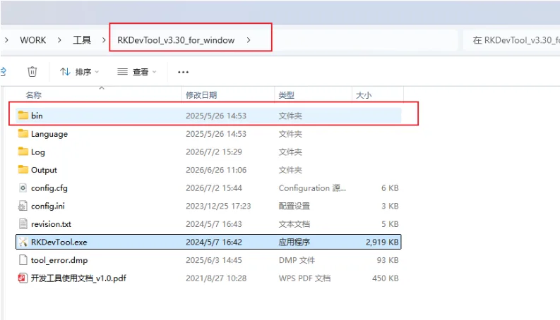

### 	2.2 RockChip烧录驱动安装

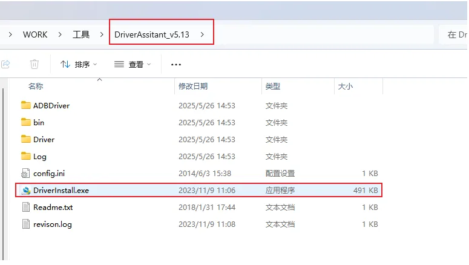


为避免驱动安装出现问题，请先点击驱动卸载，再点击驱动安装，驱动成功安装后，如下所示


### 	2.3 RockChip烧录软件安装

解压后直接运行即可（最好解压到全英文路径下面）

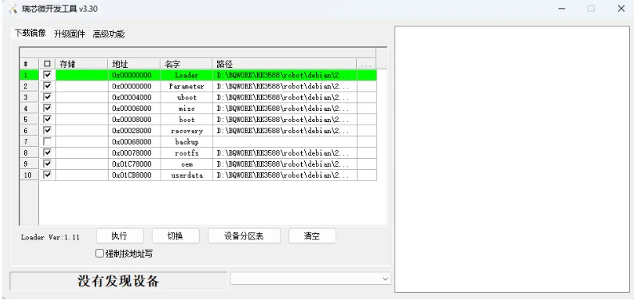

## 3. 固件烧录

用双头USB连接OTG口和PC的USB口


如何进入烧写模式(Loader)

1. 按住设备的 recovery 键不要松开，然后按一下 reset 键系统复位，大约两秒后松开 recovery 键。
2. 连接完成OTG口后，上电设备，在PC的powershell输入 adb shell 进入到设备终端，执行`reboot loader`命令

这时候进入到烧录工具可以看到下面这个现象


导入配置

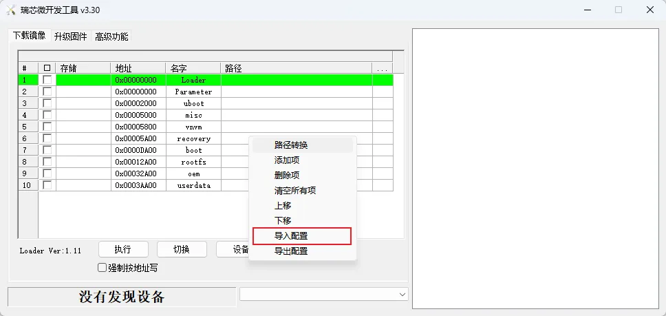


导入完成后需要根据列出的项名字选择对应的img文件

例如

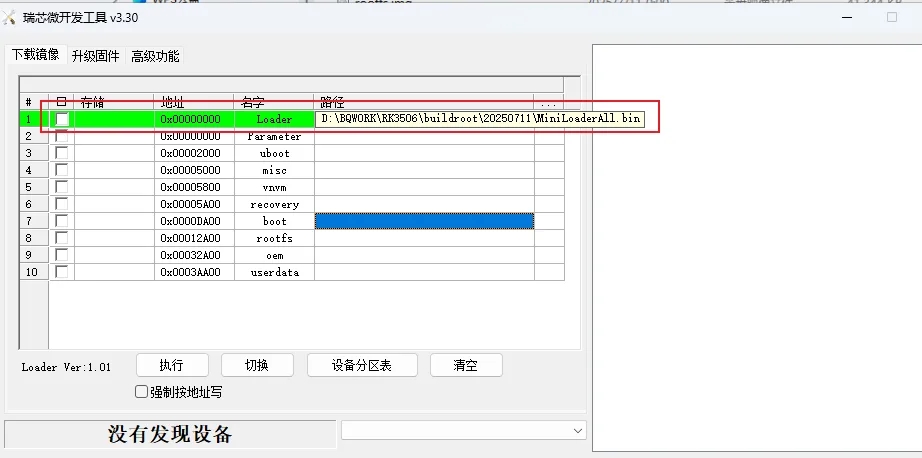

选择完成后勾选点击执行岂可。

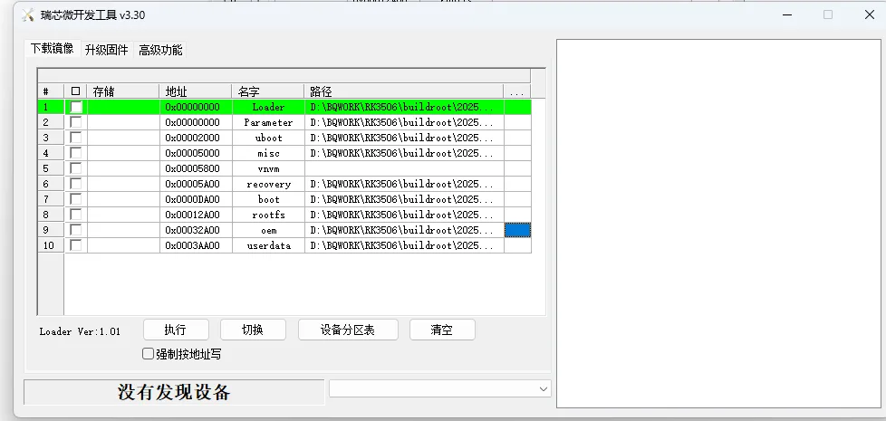

## 4. 基础功能验证

### 4.1 USB功能测试

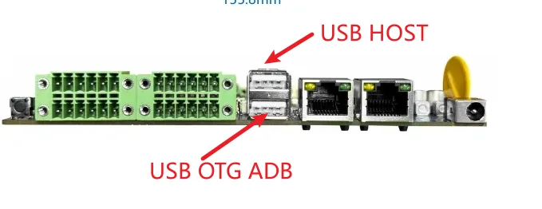

插入U盘到USB-HOST就，使用adb shell进入设备终端可以查看当前U盘是否被挂载

### 4.2 DODI功能测试

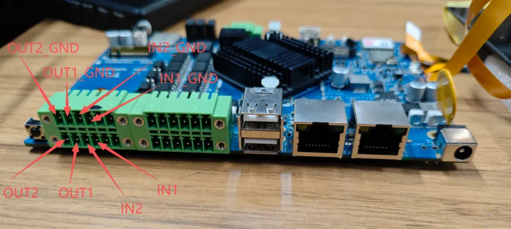

```
IN1节点 /sys/devices/platform/gpios_dido/DIN1
IN2节点 /sys/devices/platform/gpios_dido/DIN2
OUT1节点 /sys/devices/platform/gpios_dido/DOUT1
OUT2节点 /sys/devices/platform/gpios_dido/DOUT2

OUT1与OUT2 echo 1为输出高电平，echo 0 为输出低电平
参考命令 echo 1 > /sys/devices/platform/gpios_dido/DOUT1

IN1与IN2使用cat查看输入，返回值为0为输入低电平，返回值为1为输入高电平
参考命令 cat /sys/devices/platform/gpios_dido/DIN1
```

### 4.3 LED功能测试

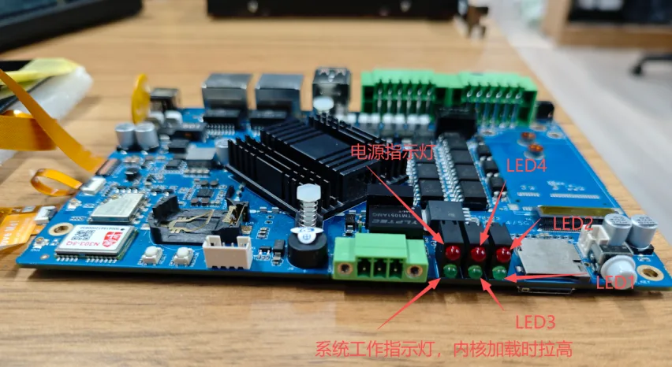

```
LED1控制节点 /sys/class/leds/led-1/brightness
LED2控制节点 /sys/class/leds/led-2/brightness
LED3控制节点 /sys/class/leds/led-3/brightness
LED4控制节点 /sys/class/leds/led-4/brightness
节点echo 1 打开LED灯，echo 0 关闭LED灯
参考命令 echo 1 > /sys/class/leds/led-1/brightness
```

### 4.4 CAN功能测试

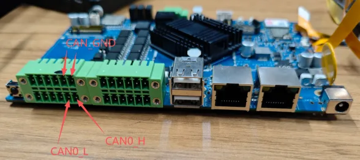

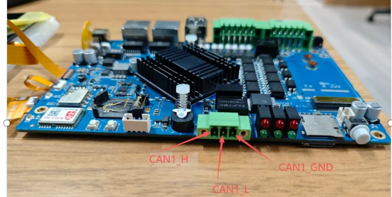

```
CAN测试方法
adb push ip /bin/
adb push cansend /bin/
adb push candump /bin/


adb shell
进入ADB命令行


执行ip 需要进入bin目录
./ip link set can1 down
./ip link set can0 down
./ip link set can0 type can bitrate 250000 sample-point 0.8 dbitrate 250000 sample-point 0.8 fd on
./ip link set can1 type can bitrate 250000 sample-point 0.8 dbitrate 250000 sample-point 0.8 fd on
./ip link set can1 up
./ip link set can0 up

can1发送
cansend can1 123#1122334455667788
can1接收
candump can1
```

### 4.5 GPS功能测试

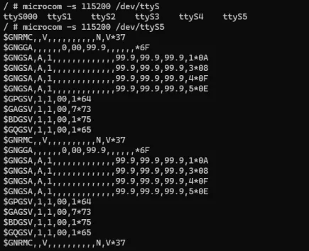

```
执行microcom -s 115200 /dev/ttyS5 可以看见GPS报文
```

### 4.6 RS232 RS485

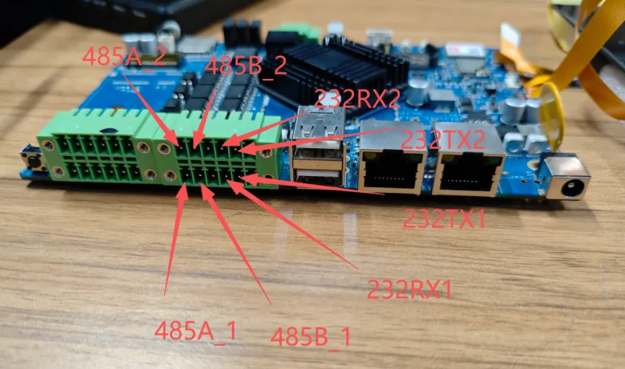

```
485_1 UART1 /dev/ttyS1   485_2 UART2 /dev/ttyS2
232_1 UART3 /dev/ttyS3   232_2 UART4 /dev.ttyS4
测试使用echo “xxxx” 发送 cat节点接收
```


