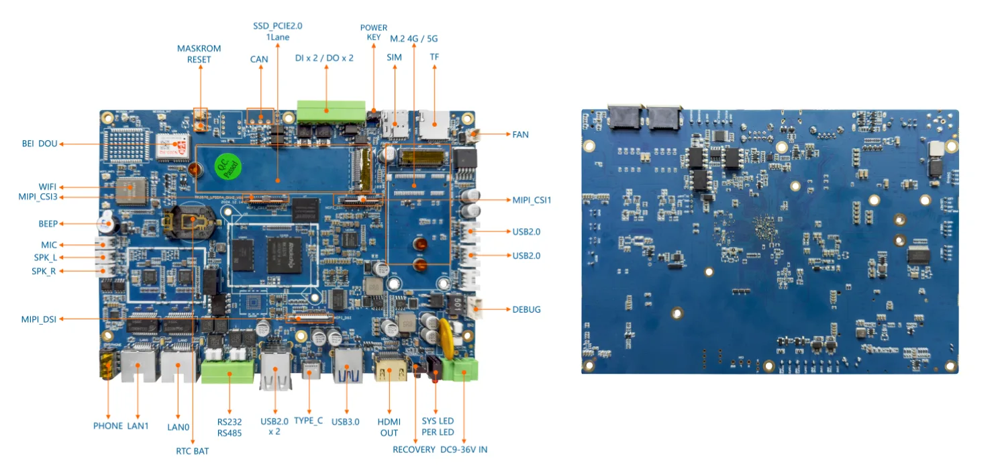
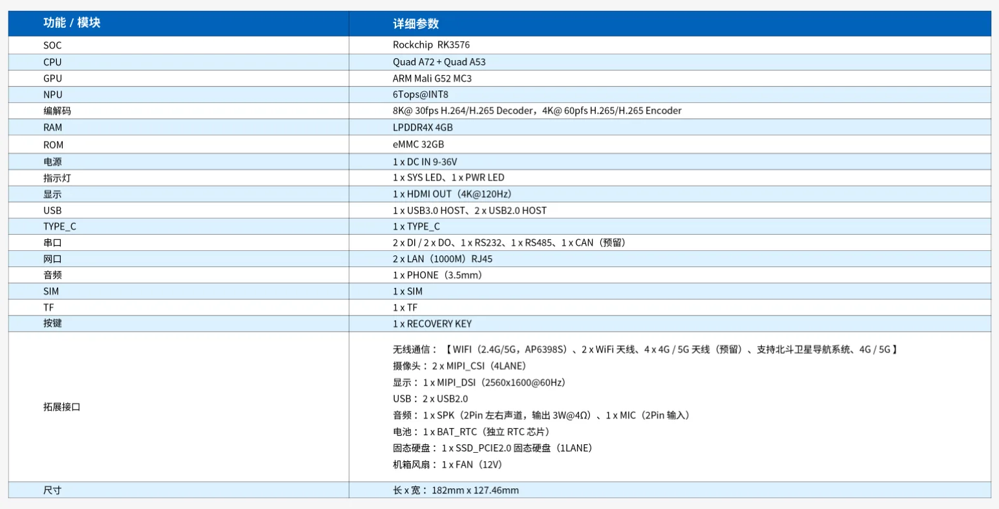
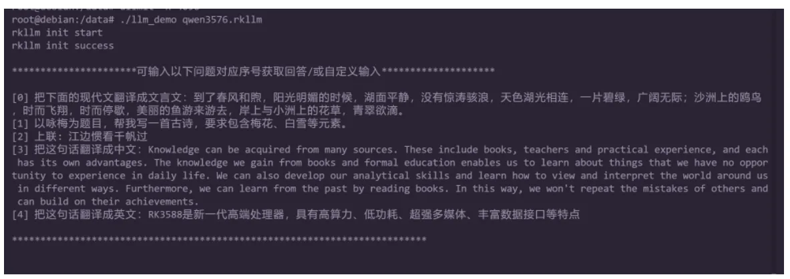

# RK3576 工业控制主板介绍

### 简介

基于瑞芯微RK3576处理器，先进制程工艺。QuadA72 + Quad A53 CPU. ARM Mali G52 MC3 GPU. 6TOPSNPU 算力。集成多种工业领域接口:RS232、RS485、CAN、GPIO、LAN、HDMI 等。支持 4G/5G网络连接。具备WIFI、蓝牙、北斗卫星导航等功能，以及 MIPI_CSI、MIPI_DSI、SPK、MIC、SSD 等拓展接口，适用于工业控制与数据采集，满足自动化需求。

## 一、 设备详情

1、接口示意



​																									图1：   RK3576 数据采集网关接口示意图

2、基本参数



​																									图2：   RK3576 数据采集网关基本参数图

## 二、固件烧写

需要在 pc 上安装 rk 的驱动，驱动版本 5.12，步骤如下

1.   解压
2.   双击 DriverInstall.exe 打开
3.   为保证驱动正确安装，建议先点击驱动卸载，再进行驱动安装，界面如下


使用工具为 RKDevTool_Release_v3.28， 版本为 3.28，***需要在 windows10/11 上进行使用，该工具目前暂不支持其他系统***

若版本较低可能出现固件无法加载的情况

##### 固件烧写

1.   按住板子上的 recovery 键并重启，进入 loader 模式，或者在板子上电开机后，使用串口、ssh 或 adb 终端，输入 reboot loader 进行 loader 模式

2.   按上述步骤操作后，会显示 “发现一个 LOADER 设备”。右键单击工具空白处，点击导入配置，选择我们提供 parameter.txt，如下

      

     根据自己镜像的位置调整镜像路径，然后勾选要更新的 镜像，然后点击“执行”按钮进行升级。

## 三、设备例程

设备相关例程[RK3576 数据采集网关例程](https://pan.baidu.com/s/1N3oW-I1l4EKugPtlbp7xCg?pwd=32d2)

链接包含如下 demo

-    rkllm demo

用户可以根据链接内的说明来进行部署

此处对 demo 进行简单说明
rkllm demo 包含如下内容

-   librkllmrt.so rkllm demo 所需运行库
-   llm_demo rkllm demo
-   qwen3576.rkllm 3576 千问 rkllm 模型
-   3576 运行通义千问大语言模型.pdf

librkllmrt.so 使用 adb 命令推送到板子 /usr/lib 目录，qwen3576.rkllm 和 llm_demo推送到板子 /data 目录，命令如下，其中的path需要根据实际修改

```
adb push path/librkllmrt.so /usr/lib
adb push path/qwen3576.rkllm /data
adb push path/llm_demo /data
```

demo 运行前需要修改文件系统句柄上限，命令如下

```
ulimit -n 4096
```

使用如下命令运行 llm_demo

```
/data/llm_demo qwen3576.rkllm
```

出现下列日志即可开始提问

客户可以通过这个 demo 快速熟悉RK3576 数据采集网关的 npu 等相关能力