# 贝启Robo3588机器人开发板主板

### 简介

贝启Robo3588机器人开发板是一款瑞芯微 RK3588+RK1828 平台的具身智能机器人开发板，专为边缘计算与机器人交互场景打造，集成高性能算力与丰富工业级接口。主板搭载双风扇主动散热，支持 4G/5G 与 Wi-Fi 无线连接，配备双路千兆 LAN、多路 USB3.0/2.0、RS232/RS485 串口、麦克风喇叭及 HDMI 、MIPI、EDP显示输出，可快速实现机器人视觉感知、运动控制与人机交互；搭配拓展板后更扩展出 6 路 CAN、10 路 DI+10路DO、4路百兆车载T1以太网、2路千兆车载T1以太网、1路普通百兆RJ45以太网口及 4路GMSL2 接口，满足复杂场景下的多传感器融合与实时控制需求，是开发服务机器人、工业 AGV、自主导航机器人等具身智能应用的高效平台。

贝启Robo3588机器人开发板外观图如图1所示：

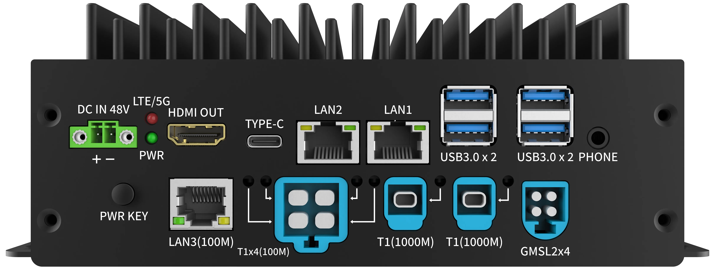

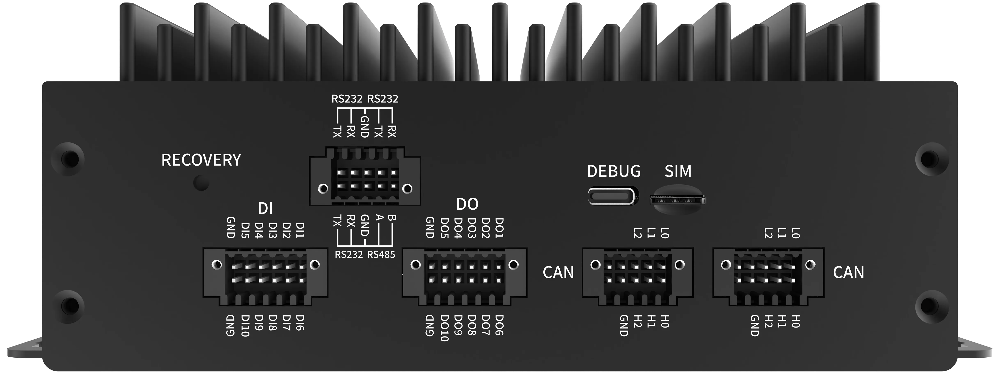

​																						图1：   贝启Robo3588机器人开发板外观图

## 一、开发板详情

**1、   贝启Robo3588机器人开发板正面接口示意图**

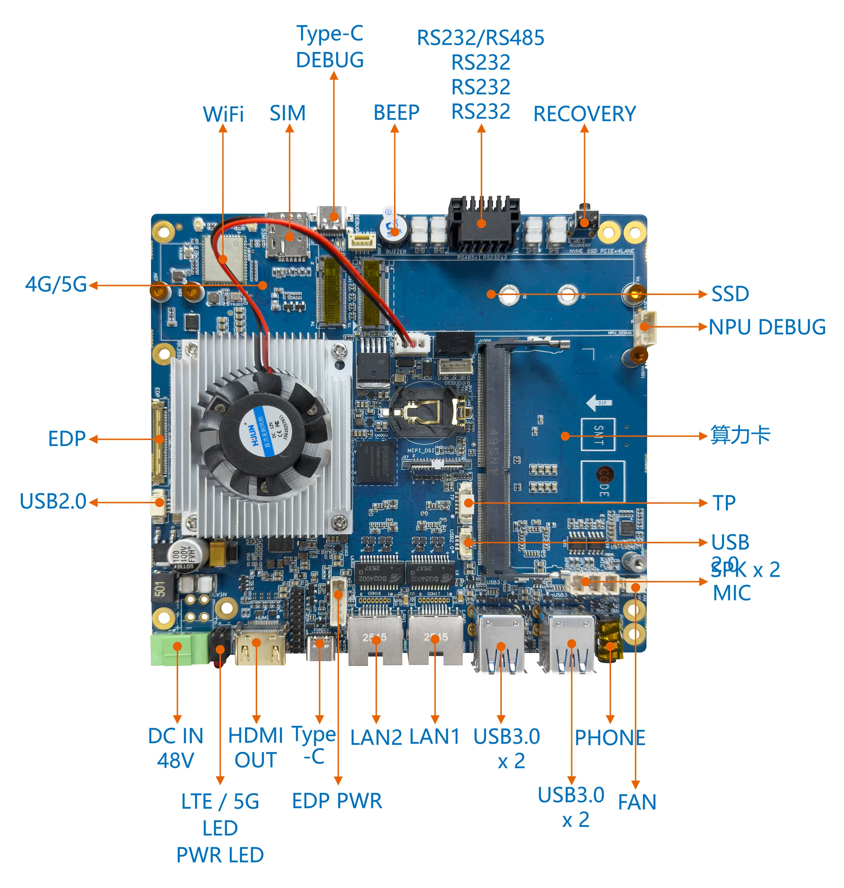

​																					图2：   贝启Robo3588机器人开发板正面接口示意图

**2、   贝启Robo3588机器人开发板反面接口示意图**

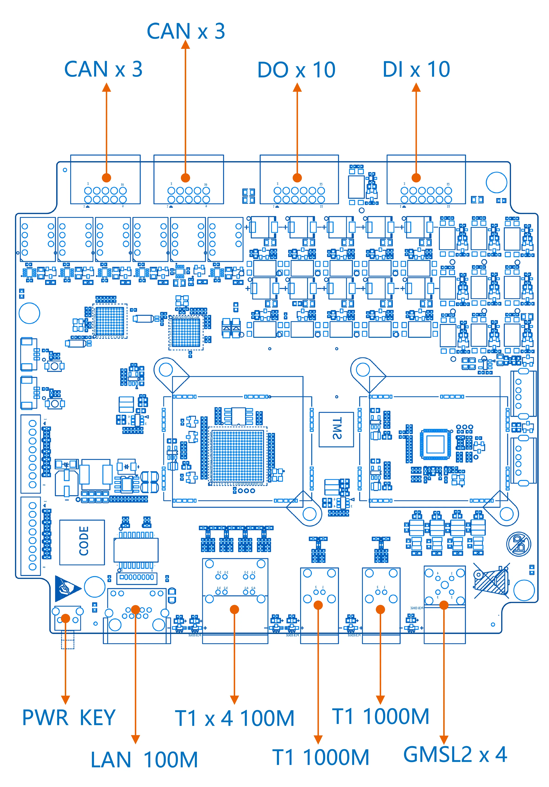

​                                                                           图3：   贝启Robo3588机器人开发板反面接口示意图

**3、 贝启Robo3588机器人拓展板接口示意图**


图4：   贝启Robo3588机器人拓展板接口示意图

## 二、开发板规格

Rockchip RK3588集成四核Cortex-A76和四核Cortex-A55核心，主频高达2.4GHz，可广泛应用于嵌入式人工智能领域。

Robo3588机器人开发板核心规格如表1所示：

| 芯片、处理器、存储 |  |
| --- | --- |
| SoC | Rockchip RK3588 |
| CPU | ARM Cortex-A76×4+ARM Cortex-A55×4 |
| GPU | G610 支持OpenGLES 1.1, 2.0, and 3.2, OpenCL up to 2.2 and Vulkan1.2，专有2D硬件加速引擎 |
| NPU | 6.0TOPs |
| RAM | 8GB 及以上 LPDDR5 |
| ROM | 64GB eMMC 5.1 |

​																表1    贝启Robo3588机器人开发板核心规格清单

贝启Robo3588机器人开发板接口规格说明如表2所示：

| 贝启Robo3588机器人开发板主板接口规格说明 |  |
| --- | --- |
| 电源输入 | DC IN 48V 宽压输入 |
| 指示灯 | 1 x PWR LED 1xLTE/5G LED |
| 调试接口 | 1x 调试串口 1 x Type-C DEBUG (系统调试)、1 x NPU DEBUG (AI算力调试专用) |
| 按键 | 1 x RECOVERY (烧录/恢复)、1 x PWR KEY (电源开关键)、1 x KEY (功能键) |
| 视频输出 (Display) | 1 x HDMI OUT (8K@60Hz)、1 x EDP (4K@60Hz)、1 x TP (触摸屏接口) |
| 摄像头输入 (Camera) | 4 x GMSL2(MinFakra) 车载摄像头接口 |
| USB 接口 | 4 x USB 3.0 Type-A、1 x Type-C |
| 串口 | 3 x RS232、1 xRS485、6 x CAN 总线接口 (通过拓展板) |
| DIDO | 10 x DI (数字输入)、10 x DO (数字输出) |
| 以太网 (标准) | 1 x LAN1 (千兆)、1 x LAN2 (千兆)、1 x LAN (100M，支持TSN、EtherCAT) |
| 车载以太网 (T1) | 4 x T1 100M 接口、2 x T1 1000M 接口 |
| 蜂窝 | 1 x M.2 接口支持 4G/5G 模组 |
| 无线网络 | 支持WIFI6 5GHz/2.4GHz, 2天线 |
| 蓝牙 | BT5.0 |
| SIM 卡 | 1 x SIM（Nano-SIM） |
| 音频 | 1x HDMI音频输出、1x 耳机输出（3.5mm, CTIA）、左右声道SPK座子（2Pins）、1 x MIC座子（2Pins） |
| 蜂鸣器 | 1x蜂鸣器 |
| 固态硬盘接口 | 1 x M.2 SSD 固态硬盘接口 (NVMe) |
| 算力扩展 | 1 x 算力卡槽 (用于进一步提升AI推理能力) |
| 其它拓展接口 | 1 xDC OUT 5VCPU风扇 : 1 x FAN_CPU（12V）USB : 2 x USB2.0(4Pins座子) ：1 x I2C 触屏座子RTC电池 ：1 x BAT_RTC（独立RTC芯片） |

​																	表2    贝启Robo3588机器人开发板接口规格说明

## 三、开发板应用场景

贝启Robo3588机器人主板凭借其独特的车载级 GMSL2 视觉输入、T1 协议以太网、多路 CAN 总线及RS232/RS485及 48V 宽压特性，广泛应用于人形机器人、高性能自动驾驶机器人、下一代自主移动机器人（AMR）、协作机器人、配送机器人与商用服务机器人、智慧边缘计算及嵌入式人工智能领域。

## 四、搭建开发环境

**1、安装依赖工具**

安装命令如下：

```
sudo apt-get update && sudo apt-get install git ssh make gcc libssl-dev liblz4-tool expect expect-dev g++ patchelf chrpath gawk texinfo diffstat binfmt-support qemu-user-static live-build bison flex fakeroot cmake gcc-multilib g++-multilib unzip device-tree-compiler ncurses-dev libgucharmap-2-90-dev bzip2 expat gpgv2 cpp-aarch64-linux-gnu libgmp-dev libmpc-dev bc python-is-python3 python2 git-core gnupg build-essential zip curl zlib1g-dev libc6-dev-i386 libncurses5 lib32ncurses5-dev x11proto-core-dev libx11-dev lib32z1-dev libgl1-mesa-dev libxml2-utils xsltproc fontconfig vim git-lfs ruby openssl libtinfo5 genext2fs openjdk-11-jdk ccache nodejs default-jdk u-boot-tools mtools mtd-utils scons gcc-arm-none-eabi libelf-dev libglvnd-dev doxygen
```

**说明：**
以上安装命令适用于Ubuntu22.04，其他版本请根据安装包名称采用对应的安装命令。

**2、获取标准系统源码**

**前提条件**

1）注册码云gitcode账号。

2）注册gitcode SSH公钥，请参考[帮助中心][https://docs.gitcode.com/docs/help/home/user_center/security_management/ssh](https://docs.gitcode.com/docs/help/home/user_center/security_management/ssh)

3）安装[git客户端](http://git-scm.com/book/zh/v2/%E8%B5%B7%E6%AD%A5-%E5%AE%89%E8%A3%85-Git)和[git-lfs](https://gitee.com/vcs-all-in-one/git-lfs?_from=gitee_search#downloading)并配置用户信息。

```
git config --global user.name "yourname"

git config --global user.email "your-email-address"

git config --global credential.helper store
```

4）安装码云repo工具，可以执行如下命令。

```
curl -s https://gitee.com/oschina/repo/raw/fork_flow/repo-py3 \>
/usr/local/bin/repo \#如果没有权限，可下载至其他目录，并将其配置到环境变量中

chmod a+x /usr/local/bin/repo

pip3 install -i https://repo.huaweicloud.com/repository/pypi/simple requests
```

**获取源码操作步骤**

1） 通过repo + ssh 下载（需注册公钥，请参考码云帮助中心）。

```
repo init -u git@gitcode.com:openharmony-robot/manifest.git -b OpenHarmony-Embodied-1.0.1 -m chipsets/bq3588.xml --no-repo-verify

repo sync -c

repo forall -c 'git lfs pull'
```

2） 通过repo + https 下载。

```
repo init -u https://gitcode.com/openharmony-robot/device_board_bearkey/tree/OpenHarmony-5.1.0-Release-tag/bq3588

repo sync -c

repo forall -c 'git lfs pull'
```

**执行prebuilts**

在源码根目录下执行脚本，安装编译器及二进制工具。

```
bash build/prebuilts_download.sh
```

下载的prebuilts二进制默认存放在与OpenHarmony同目录下的OpenHarmony_2.0_canary_prebuilts下。

## 五、编译调试

**1、编译**

在Linux环境进行如下操作:

1） 进入源码根目录，执行如下命令进行版本编译。

./build.sh -p robo3588 开始编译

2） 检查编译结果。编译完成后，log中显示如下：

```
post_process

=====build robo3588 successful.

2025-12-04 10:11:11
```

编译所生成的文件都归档在out/robo3588/目录下，结果镜像输出在out/robo3588/packages/phone/images/ 目录下。

3） 编译源码完成，请进行镜像烧录。

**2、烧录工具**

烧写工具下载及使用。

工具路径：robo3588/tools/RKDevTool_v3.28_for_window.zip

烧录说明文档见RKDevTool_v3.28_for_window.zip的 “开发工具使用文档_v1.0.pdf“

**3、硬件清单**

- 贝启Robo3588机器人主板
- 12V DC电源
- USB Type-A 转 Type-C 数据线
- 串口小板

**4、PC环境配置**

我们会提供驱动安装包以及烧录工具包、以及烧录固件

下载方式：联系我们公司客服获取

下载完成后解压。

1） ADB工具安装

hdc的工具在bin目录下，打开系统设置环境变量到该目录即可使用hdc工具。

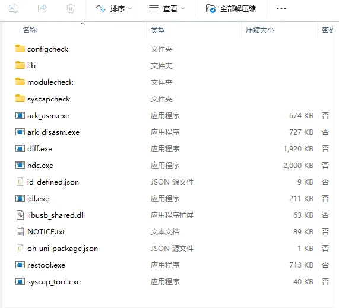

2） RockChip烧录驱动安装


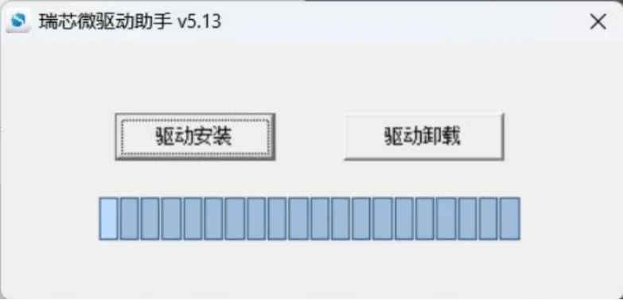

为避免驱动安装出现问题，请先点击驱动卸载，再点击驱动安装，驱动成功安装后，如下所示


3） RockChip烧录软件安装

解压后直接运行即可（最好解压到全英文路径下面）


**5、固件烧录**

使用USB Type-A 转 Type-C 数据线连接设备OTG口和PC的USB口

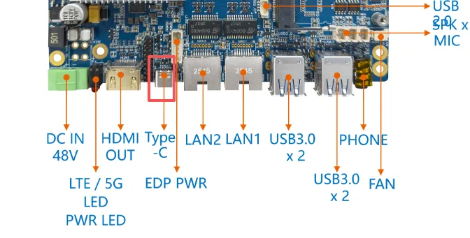

如何进入烧写模式(Loader)

1. 按住设备的 recovery 键不要松开，然后按一下 reset 键系统复位，大约两秒后松开 recovery 键。
2. 连接完成OTG口后，上电设备，在PC的powershell输入 hdc shell 进入到设备终端，执行`reboot loader`命令

这时候进入到烧录工具可以看到下面这个现象


导入配置


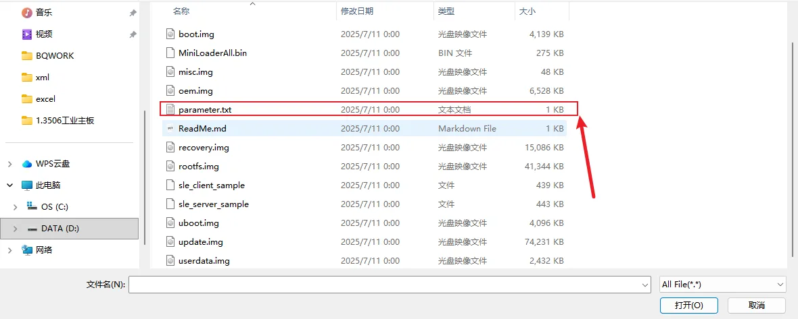

导入完成后需要根据列出的项名字选择对应的img文件

例如


选择完成后勾选点击执行岂可。


## 六、基础功能验证

### 6.1 USB功能测试


接上鼠标/键盘/U盘等常见usb设备能够正常使用

### 6.2 usb-otg

执行wim+r 输入cmd 打开终端，输入adb shell可以进入


### 6.4 BUZZER

进入hdc shell 界面(或者串口界面)执行以下命令可以实现蜂鸣器的开关
```
echo 0 > /sys/devices/platform/leds/leds/buzzer_gpio/brightness (关闭)
echo 0 > /sys/devices/platform/leds/leds/buzzer_gpio/brightness (开启)
```

### 6.5 hdmi-out

接hdmi外接屏，屏幕正常显示


### 6.6 有线网络

设备连接网线，进入hdc shell 界面(或者串口界面)执行以下命令可以看到ip，通过ping baidu.com 能够正常联网

```
ifconfig
ping baidu.com
```
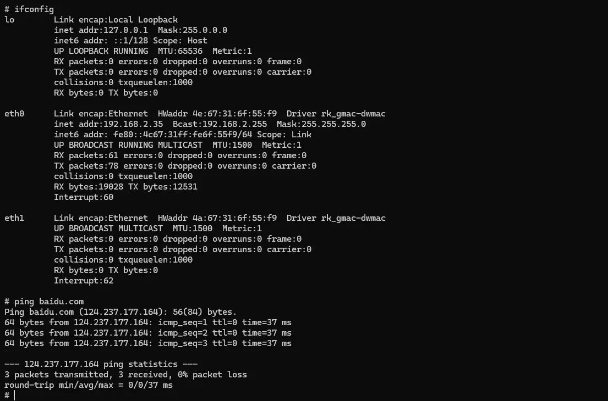
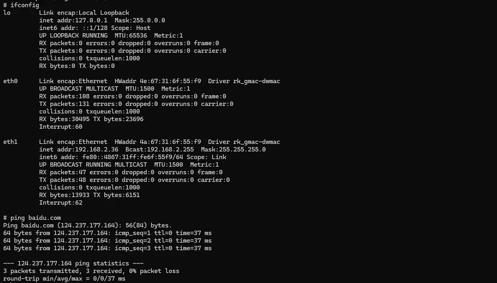

### 6.7 CPU-FAN

接上风扇外设，能够正常转动

### 6.8 RTC

进入hdc shell 界面(或者串口界面)执行以下命令可以看到rtc时间

```
hwclock
```


### 6.9 485

设备通过485串口和上位机进行通信设备，对应的串口是/dev/ttyS7


### 6.10 232

设备通过232串口和上位机进行通信设备，对应的串口是/dev/ttyS0、/dev/ttyS5、/dev/ttyS9

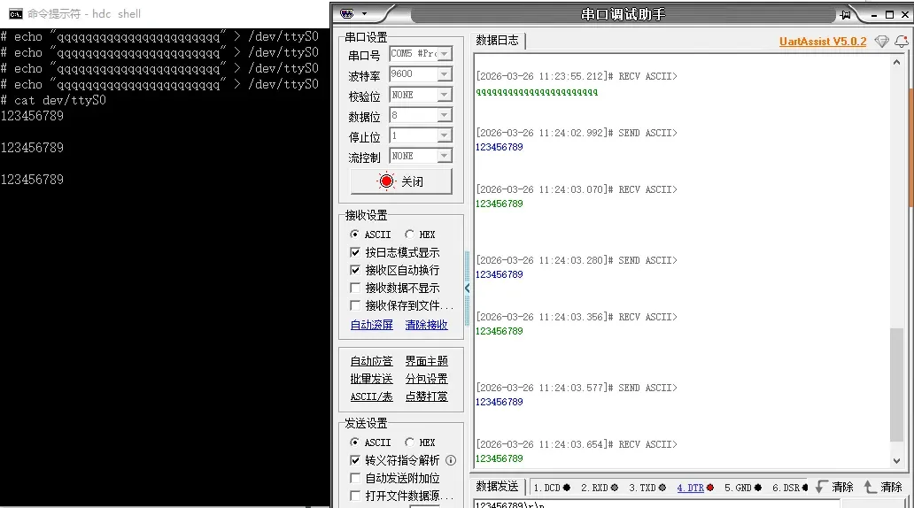


### 6.11 wifi

在桌面打开设置，选择第一个点击进入WLAN进入选择所需网络连接，能够正常上网


### 6.12 bluetooth

在桌面打开设置，选择第二个蓝牙点击进入选择连接对应蓝牙设备，能够正常使用


### 6.13 nvme

设备接上nvme外设，在/dev/block下面能够识别到，并且通过mount，能够实现对nvme的读写


挂载和卸载命令

```
# cd dev/block/
# ls
by-name  loop5         mmcblk0p1   mmcblk0p15  mmcblk0p7  nvme0n1p3
loop0    loop6         mmcblk0p10  mmcblk0p2   mmcblk0p8  platform
loop1    loop7         mmcblk0p11  mmcblk0p3   mmcblk0p9  ram0
loop2    mmcblk0       mmcblk0p12  mmcblk0p4   nvme0n1    zram0
loop3    mmcblk0boot0  mmcblk0p13  mmcblk0p5   nvme0n1p1
loop4    mmcblk0boot1  mmcblk0p14  mmcblk0p6   nvme0n1p2
# mkdir test
#mount nvme0n1p1 test
# ls test/
EFI                           SKY1-EVB-PCIEX11.DTB
GRUB                          SKY1-EVB-PCIEX2.DTB
IMAGE                         SKY1-EVB-PCIEX4.DTB
ROOTFS.CPIO.GZ                SKY1-EVB-PCIEX8.DTB
SKY1-BATURA.DTB               SKY1-EVB-PCIE_WIDTH_X1.DTB
SKY1-CLOUDBOOK.DTB            SKY1-EVB-PCIE_WIDTH_X2.DTB
SKY1-CRB.DTB                  SKY1-EVB-PCIE_WIDTH_X4.DTB
SKY1-EMU-PM.DTB               SKY1-EVB-SOF-ALC5682-ALC1019.DTB
SKY1-EMU-SMP.DTB              SKY1-EVB-USB4_5.DTB
SKY1-EMU.DTB                  SKY1-EVB.DTB
SKY1-EVB-DISPLAY.DTB          SKY1-FPGA.DTB
SKY1-EVB-HDA-ALC256.DTB       SKY1-ORANGEPI-6-PLUS-40PIN-PWM.DTB
SKY1-EVB-ISO.DTB              SKY1-ORANGEPI-6-PLUS-40PIN.DTB
SKY1-EVB-ISP.DTB              SKY1-ORANGEPI-6-PLUS.DTB
SKY1-EVB-LT7911UXC-AUDIO.DTB  SKY1-ORION-O6-40PIN.DTB
SKY1-EVB-NPU-RESMEM.DTB       SKY1-ORION-O6.DTB
SKY1-EVB-PCIEX10.DTB          initrd.img-6.6.89-cix-build-generic
# umount test
```

### 6.14 NPU

设备接上RK1828外设，执行lspci能够识别设备


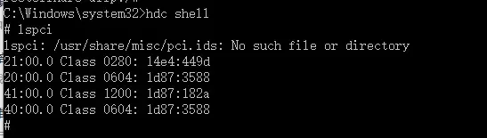


### 6.15 NPU-Fan

设备接上风扇能够正常运行

### 6.16 npu 代码测试

进入hdc shell 执行下列测试命令

```
vendor/bin/rknn_yolov5_deme
```
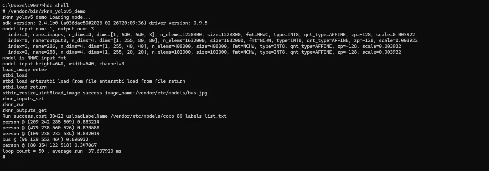

### 6.17 Audio

设备接上耳机或喇叭，点击桌面音乐图标播放音乐能够正常放声


通过命令安装对应测试hap，点击录音，录音文件能够正常播放

```
hdc install C:\Users\19037\Desktop\recorder.hap
```


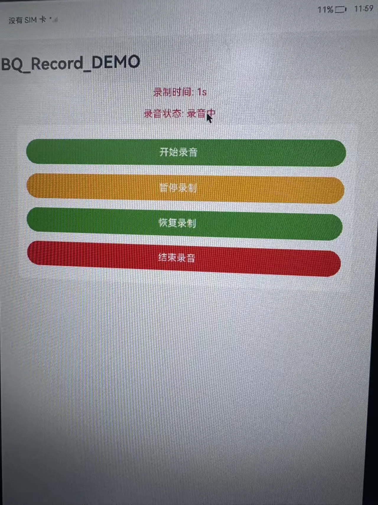
