# RK3568 OpenHarmony 系统用户手册

## 一、RK3568鸿蒙简化板介绍

### 1.1 RK3568 开发板简介

本开发板基于瑞芯微 RK3568 四核 Cortex-A55 处理器设计，主频最高 2.0GHz，集成 Mali-G52 GPU。板卡定位于工业控制与物联网网关场景，在核心功能完整保留的基础上，对接口布局进行优化精简，以更紧凑的尺寸（146mm×90mm）满足空间受限场景的部署需求。

本手册主要分为三部分：

1. **产品整体概述**  

   简要介绍开发板接口资源、性能等。

2. **环境搭建**

   介绍相关环境的安装以及烧录方法。

3. **功能测试**  

   通过命令行对开发板的各项接口和系统功能进行测试。

---

## 二、 烧录系统

RK3568 目前支持 **OTG 烧写方式**。用户资料中提供了相应的烧写工具。

### 2.1 准备工作：安装相关驱动

驱动工具路径：

```text
5-工具\DriverAssitant_v5.13.zip
```

操作步骤：

1. 将 `DriverAssitant_v5.13.zip` 解压到任意目录；
2. 以管理员权限运行 `DriverInstall.exe`；
3. 为避免驱动安装异常，建议先点击 **驱动卸载**；
4. 再点击 **驱动安装**；
5. 出现安装成功提示后，表示驱动安装完成。

> 注意：驱动安装需要管理员权限。

---

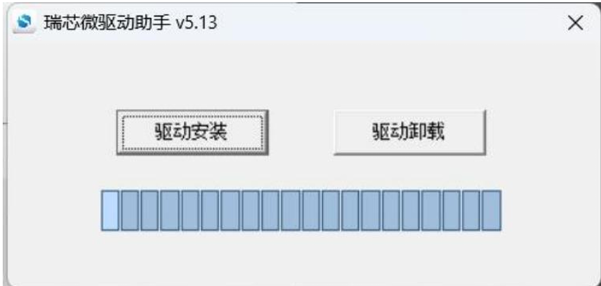

### 2.2 烧录操作：烧写固件到设备

固件和烧写工具：

```text
固件：由贝启提供
烧写工具：RKDevTool_Release.zip
```

RKDevTool 是瑞芯微提供的开发工具。使用前建议将工具解压到**全英文路径**下。

烧写前准备：

1. 接上电源适配器，开发板上电；

2. 使用 USB 线连接开发板的 `	USB 3.0 OTG `接口与电脑主机 USB 端口；

   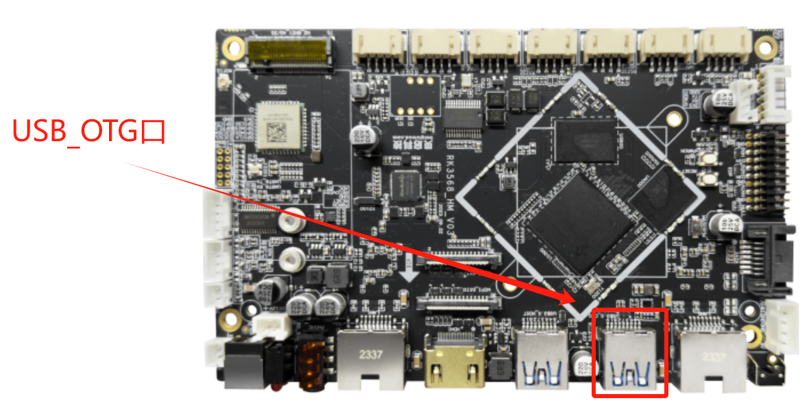

3. 按住开发板上的 `recovery` 键不要松开；

   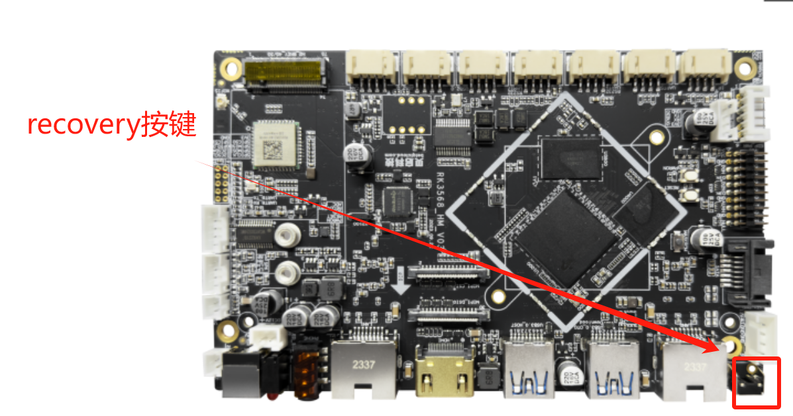

4. 按一下 `reset` 键，使系统复位；

   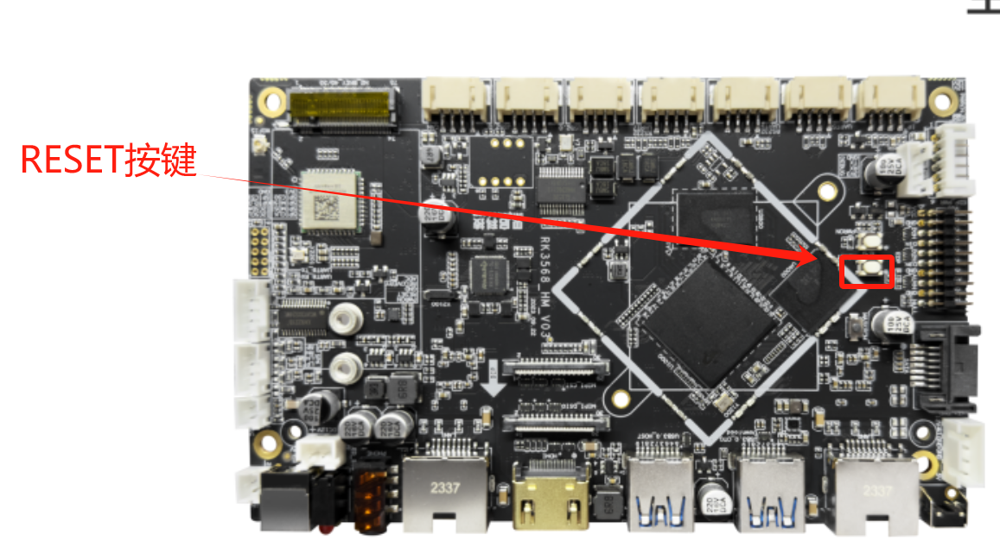

5. RKDevTool 工具上会提示发现 `LOADER` 设备或 `MASKROM` 设备，再松开 `	recovery`按键。

> 注意：识别设备时，开发板上电过程中需要保持 `recovery` 按键按下状态。

> 注意：理论上 RKDevTool 解压目录可以随意，但如果工具打开后界面异常，建议将其解压到全英文目录下。

烧写步骤：

1. 打开 RKDevTool；

2. 确认工具显示：`发现一个 LOADER 设备` 或 `发现一个 MASKROM 设备`；

3. 清空工具所有项

   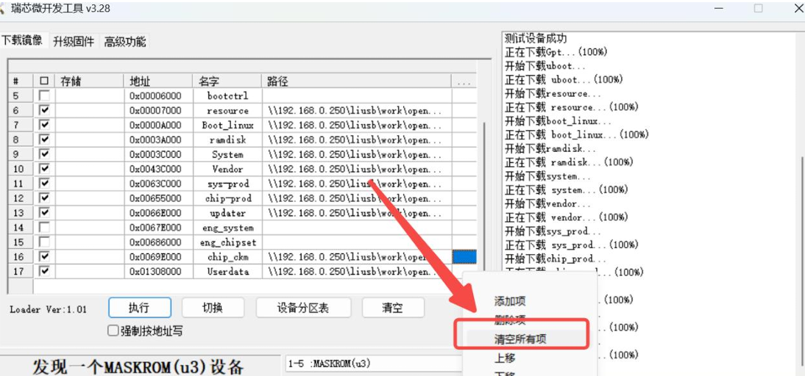

4. 清空完成后，点击 **导入配置**；

   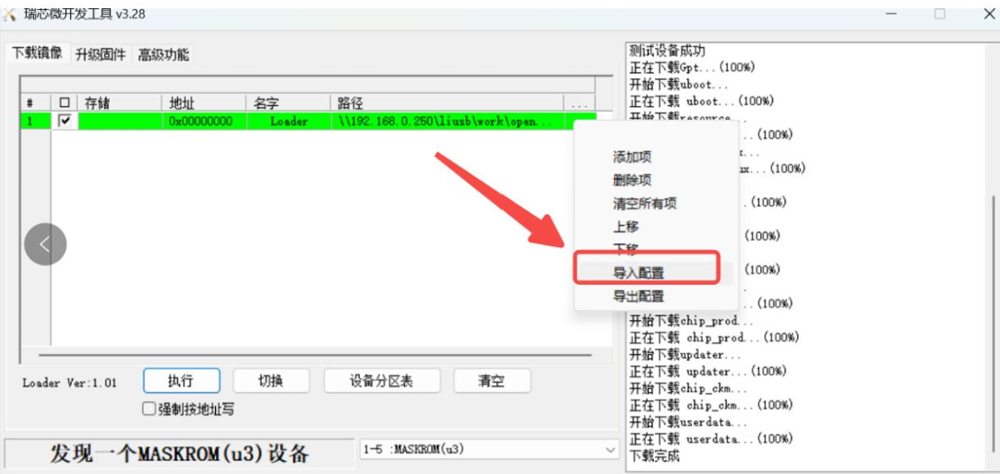

5. 选择镜像目录下的 `config.cfg` 文件；

   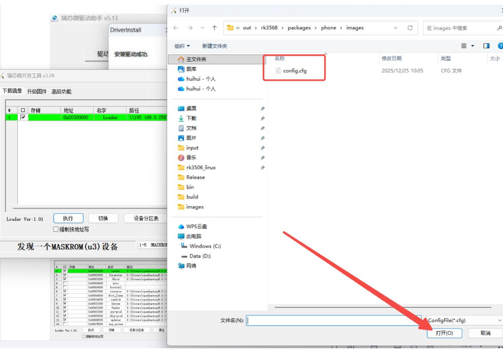

   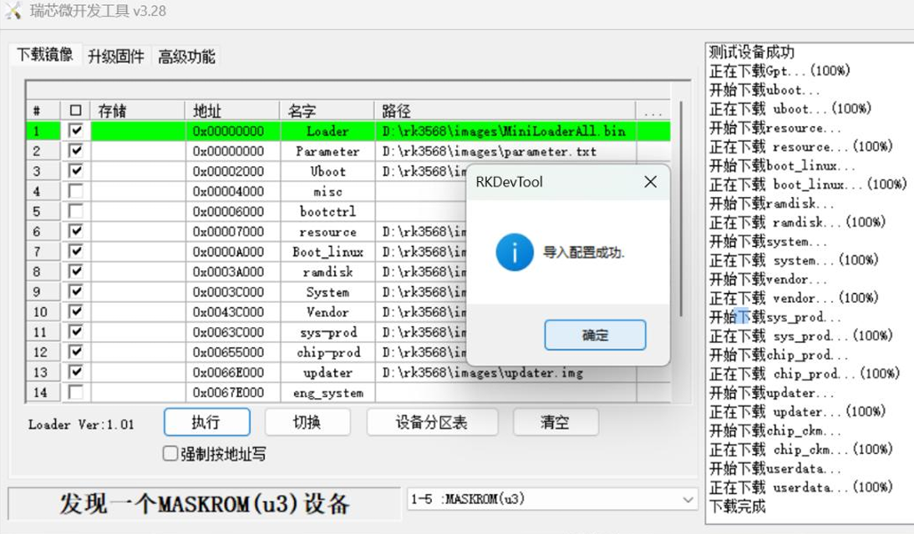

6. 依次选择工具所勾选的镜像文件；

   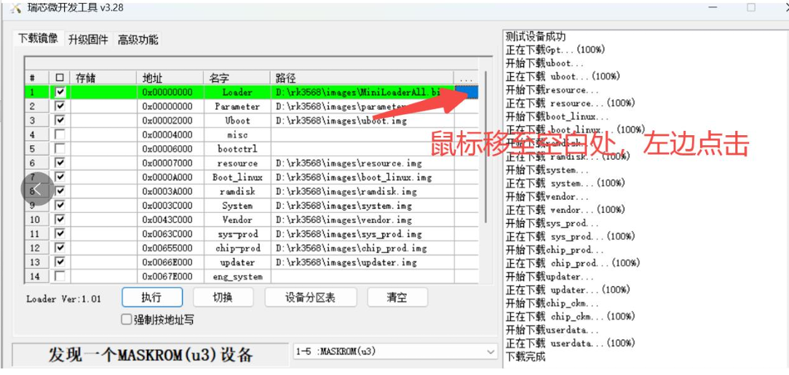

   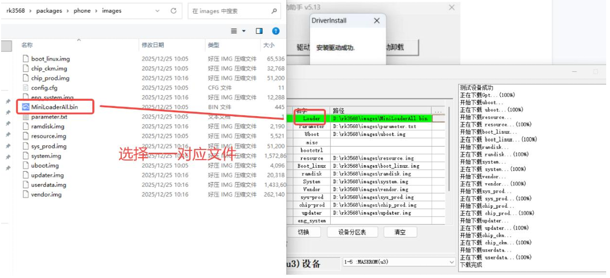

7. 点击 **执行** 按钮开始升级。

   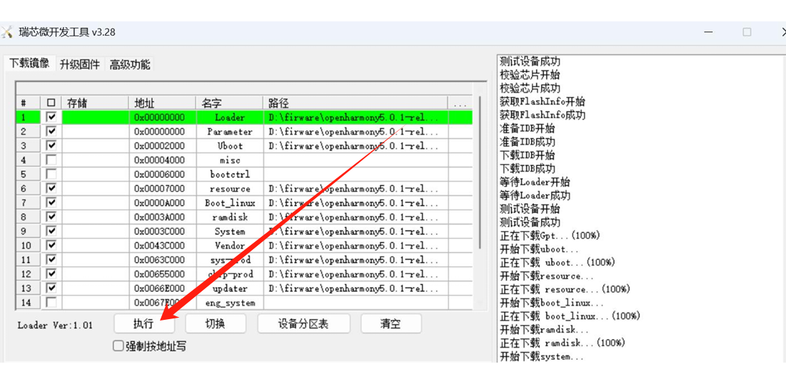

等待工具左侧显示烧录完成即可。

---

## 三、RK3568 平台界面功能使用及测试

### 3.1 桌面功能测试

开发板启动后，进入系统桌面。可通过桌面图标和系统应用检查基础显示、触控或鼠标操作是否正常。

测试重点：

- 桌面是否正常显示；
- 应用图标是否正常加载；
- MIPI屏幕触摸操作是否正常；
- 应用是否能够正常打开;

开发板启动桌面显示如下：

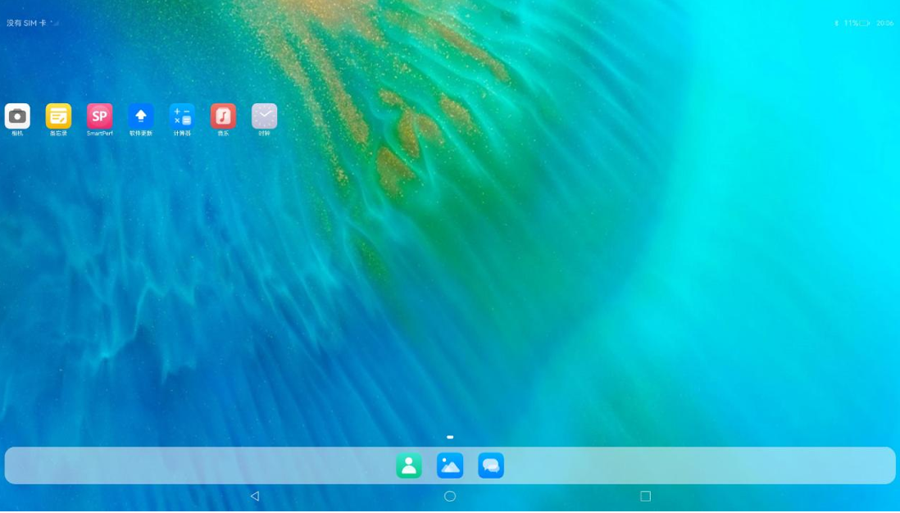

---

### 3.2 Wi-Fi 测试

> 说明：由于网络环境不同，进行 Wi-Fi 测试时需要根据实际网络情况进行设置。用户也可以使用手机热点进行测试。

测试步骤：

1. 打开系统 **设置**；

2. 进入 **WLAN**；

3. 打开 WLAN 开关；

4. 查看是否能够扫描到 Wi-Fi 设备；

5. 选择目标 Wi-Fi；

6. 输入密码并点击连接；

   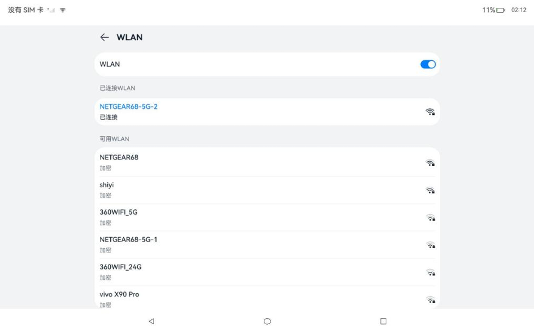

7. 连接成功后，打开命令行窗口hdc shell 进入Openharmony系统后，进入系统后可使用如下命令查看网络信息：

```bash
# ifconfig
wlan0 	Linkencap:Ethernet HWaddrc0:f5:35:32:68:da Driverbcmsdh_sdmmc
        inetaddr:192.168.0.132 Bcast:192.168.0.255 Mask:255.255.255.0
        inet6addr: fe80::c2f5:35ff:fe32:68da/64Scope:Link
        UPBROADCASTRUNNINGMULTICAST MTU:1500 Metric:1
        RXpackets:411errors:0dropped:0overruns:0frame:0
        TXpackets:172errors:0dropped:0overruns:0carrier:0
        collisions:0txqueuelen:1000
```

---

### 3.3 网口测试

> 注意：LAN1、LAN2 需要依次测试，测试有线网口时，需要断开 Wi-Fi 或其他网络，避免测试结果混淆。

**LAN0 测试示例**

测试步骤：

1. 开发板网口插上以太网；
2. 打开cmd 命令窗口 ，输入 hdc shell 进入Openharmony系统
3. 使用命令查看网络信息：

```bash
#ifconfig
eth0 	Linkencap:Ethernet HWaddraa:78:e9:09:aa:c4 Driverrk_gmac-dwmac
        inetaddr:192.168.0.133 Bcast:192.168.0.255 Mask:255.255.255.0
        inet6addr: fe80::a878:e9ff:fe09:aac4/64Scope:Link
        UPBROADCASTRUNNINGMULTICAST MTU:1500 Metric:1
        RXpackets:59errors:0dropped:0overruns:0frame:0
        TXpackets:47errors:0dropped:0overruns:0carrier:0
        collisions:0txqueuelen:1000
```

网络连通性测试：

```bash
ping qq.com -c 3
```

测试结果：

```text
PING qq.com(123.150.76.218)56(84) bytes of data.
64 bytes from 123.150.76.218(123.150.76.218): icmp_seq=1ttl=53 time=43.8ms
64 bytes from 123.150.76.218(123.150.76.218): icmp_seq=2ttl=53 time=42.4ms
64 bytes from 123.150.76.218(123.150.76.218): icmp_seq=3ttl=53 time=48.7ms
---qq.compingstatistics--
3 packets transmitted,3received,0%packet loss, time 3005ms
```

如果出现 `0% packet loss`，说明网络通信正常。LAN1测试步骤一致，不再重复。

---

### 3.4 系统信息查询

查看内核和 CPU 信息：

```bash
uname -a
```

示例输出：

```text
Linux localhost 6.6.22 #1 SMP Tue Nov 11 15:14:30 CST 2025 aarch64
```

查看环境变量：

```bash
env
```

示例输出：

```text
HOME=/
TERM=linux
PATH=/usr/local/bin:/bin:/usr/bin
hardware=rk3588
```

---

### 3.5 UART 串口测试

#### 3.5.1 准备工具和环境

测试前需要准备：

- 485 、232串口连接工具；
- PC端串口助手；

> 说明：也可以使用资料中的 `demo -> bq_uart` 应用进行测试。应用使用说明位于网盘资料的 `demo` 文件夹下。

串口硬件接口介绍：

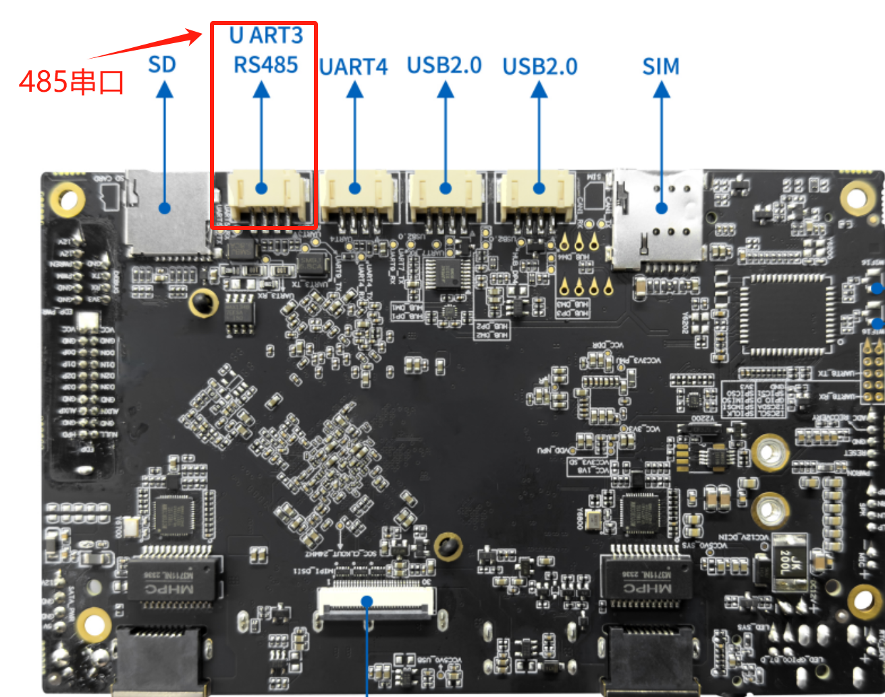

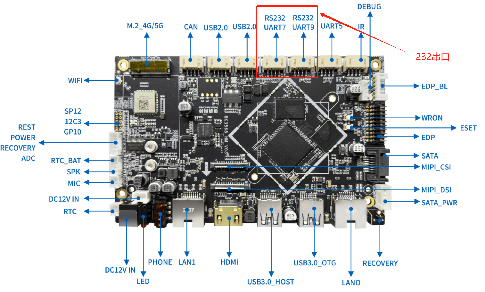


测试工具介绍：

1. 485串口测试工具

   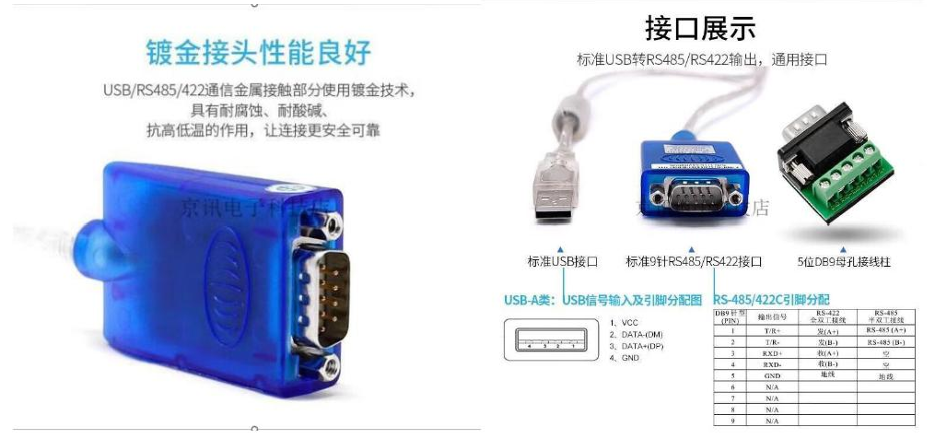

2. 232串口测试工具

   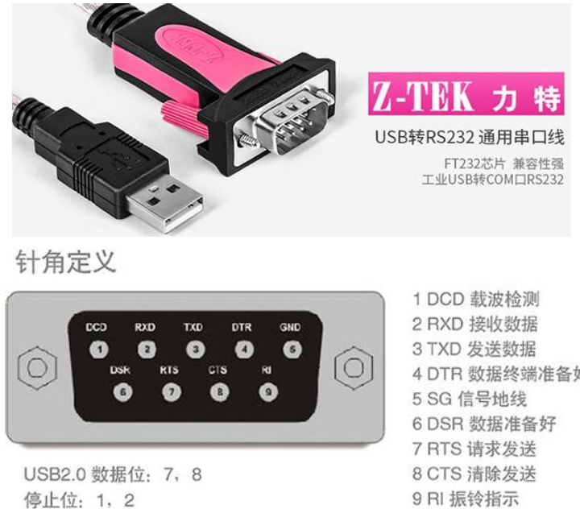

3. PC端串口助手

   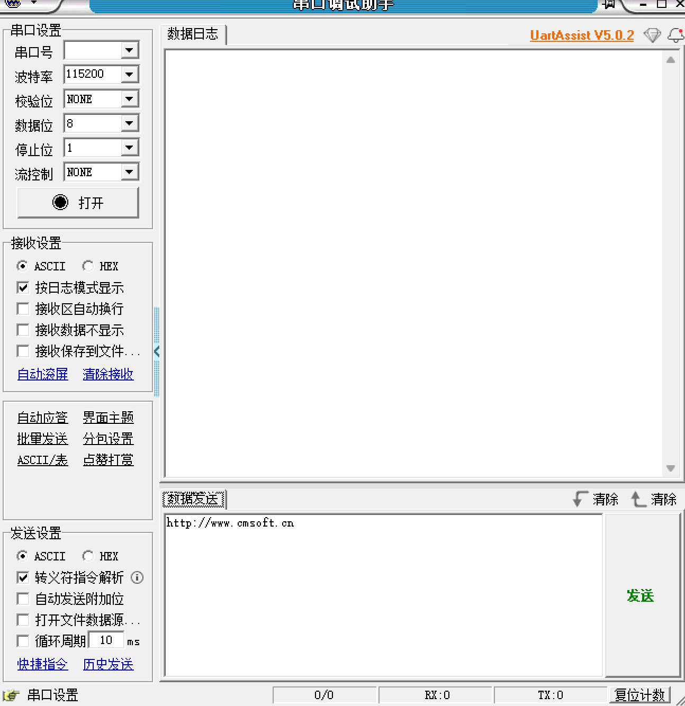

   > 注意：测试工具不限，本例测试以如图所示工具进行测试，实际使用其他工具均可。

---

#### 3.5.2 RS485功能测试

##### 3.5.2.1 RS485_UART3 发送功能测试

测试步骤：

1. 将485串口工具与开发板RS485串口相连；
2. 打开PC端串口助手，设置相关参数，波特率，数据位，校验位等，设置完后，点击打开；
3. 打开cmd 命令窗口，输入hdc shell进入Openharmony系统中；
4. 在终端输入：

```bash
microcom -s 115200 /dev/ttyS3
```

命令执行后，在终端命令行下方输入测试数据，PC端串口助手侧应能接收到对应数据。

测试判断：

- PC串口助手能接收到开发板发送的数据，说明发送功能正常；

测试结果：

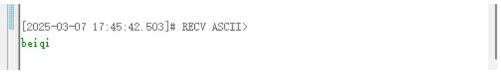

---

##### 3.5.2.2 RS485_UART3 接收功能测试

测试步骤：

1. 打开cmd 命令窗口，输入hdc shell进入Openharmony系统中；

2. 在cmd命令终端输入：

   ~~~
   microcom -s 115200 /dev/ttyS3
   ~~~

3. PC端串口助手点击发送数据；

测试判断：

- 终端能接收到串口助手发送的数据，说明接收功能正常；

测试结果：


> 注意：如果接收不到，优先检查 A/B 接线是否接反、串口参数是否一致。

---

#### 3.5.3 UART 232 测试

##### 3.5.3.1 RS232_UART7 发送功能测试

测试步骤：

1. 将232串口工具与开发板RS232串口相连；

2. 打开PC端串口助手，设置相关参数，波特率，数据位，校验位等，设置完后，点击打开；

3. 打开cmd 命令窗口，输入hdc shell进入Openharmony系统中；

4. 在终端输入：

   ~~~
   microcom -s 115200 /dev/ttyS7
   ~~~

5. 命令执行后，在命令行下方输入

   ~~~
   bei qi
   ~~~

测试判断：

- PC串口助手能接收到开发板发送的数据，说明发送功能正常；

测试结果：

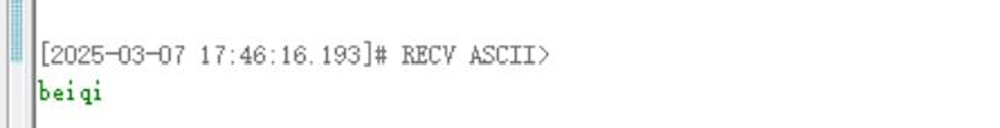

---

##### 3.5.3.2 RS232_UART7 接收测试

测试步骤：

1. 打开cmd 命令窗口，输入hdc shell进入Openharmony系统中；

2. 在cmd命令终端输入：

   ~~~
   microcom -s 115200 /dev/ttyS7
   ~~~

3. 串口助手中发送数据；

测试判断：

- 终端能接收到串口助手发送的数据，说明接收功能正常；

测试结果：


---

### 3.6 USB 鼠标测试

将 USB 鼠标接入开发板 USB 接口，使用鼠标进行点击测试。

测试判断：

- 鼠标能够正常移动；
- 点击无误触；
- 坐标位置正确；
- 桌面或应用能够正常响应。

满足以上条件，说明 USB 鼠标功能正常。

如图所示：

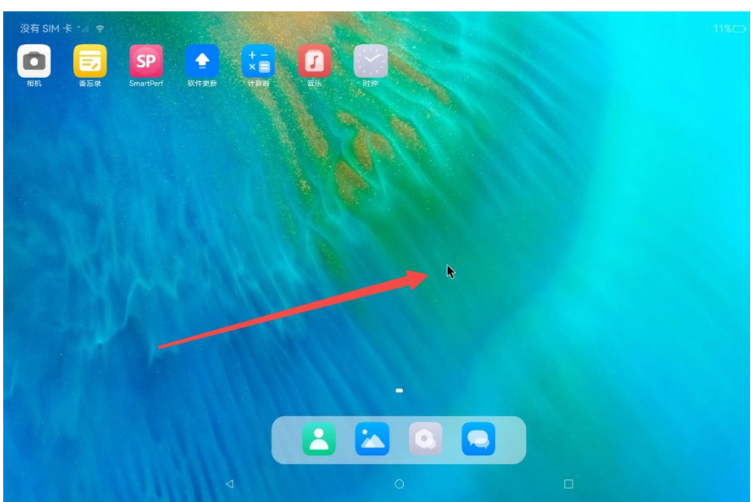

---

### 3.7 USB 测试

USB 端口可连接以下设备进行测试：

- USB 鼠标；
- USB 键盘；
- U 盘；
- 其他 USB 外设。

测试重点：

- 插入设备后是否能识别；
- 鼠标、键盘是否能正常操作；
- U 盘是否能正常识别；
- 是否支持热插拔。

插入设备后测试正常即可。

---

### 3.8 蓝牙测试

测试步骤：

1. 确认蓝牙天线已正确连接；

   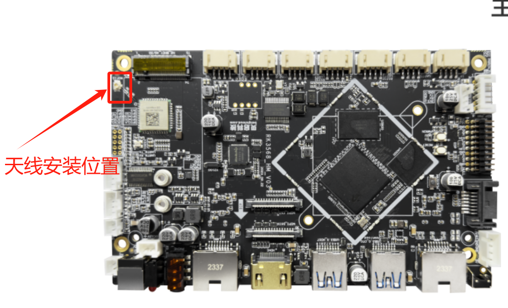

2. 打开系统 **设置**；

3. 进入 **蓝牙**；

4. 打开蓝牙开关；

5. 点击扫描；

6. 选择目标蓝牙设备；

7. 点击连接；

8. 确认连接成功。

   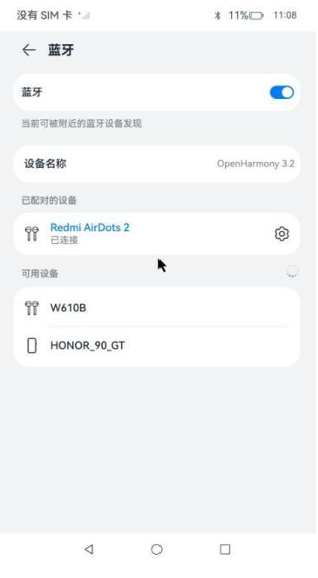

测试判断：

- 能扫描到蓝牙设备；
- 能够正常连接；
- 连接状态显示正常。
- 打开音乐应用播放音频，通过已连接的蓝牙耳机确认声音输出是否正常。

---

### 3.9 耳机测试

测试步骤：

1. 找到开发板上丝印标识为 `PHONE` 的接口；

2. 插入耳机；

   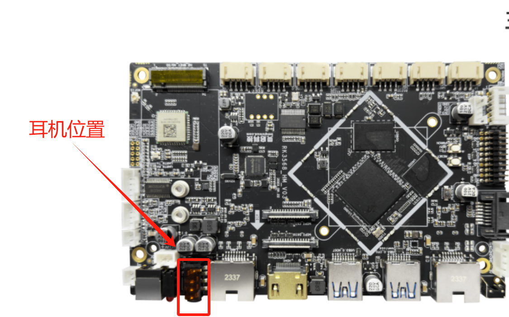

3. 打开系统桌面的音乐播放器；

   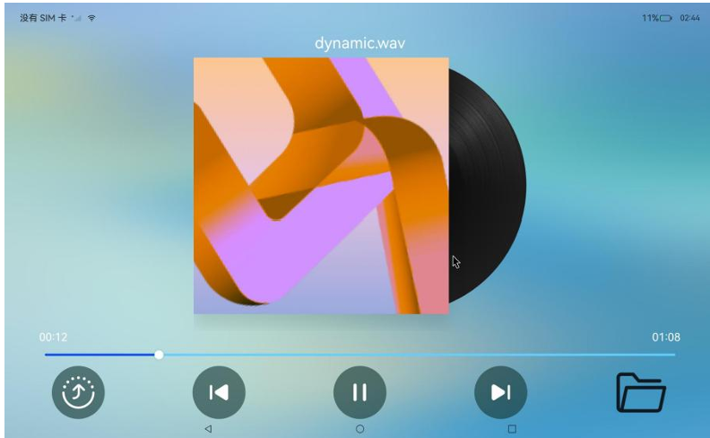

4. 点击播放音乐；

5. 确认耳机是否有声音输出。

测试判断：

- 耳机有声音输出，说明耳机接口功能正常；
- 如果无声音，需要检查耳机、音量、播放器以及接口接触情况。

---

### 3.10 MIC测试

测试步骤：

1. 网盘中下载 emo->bq_recorder.hap，下载录音应用；

2. 打开cmd命令窗口，输入hdc install 命令进行安装

   ~~~
   C:\Users\beiqi>hdc install /XXXX/recorder.hap
   ~~~

3. 找到板子丝印标有MIC位置，安装好硬件

   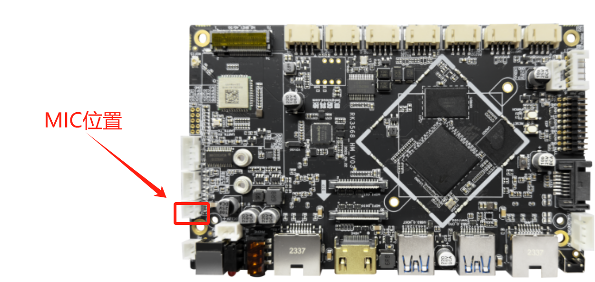

4. 点击打开应用后，点击录音，录音完毕后，点击播放，插上耳机或扬声器，

   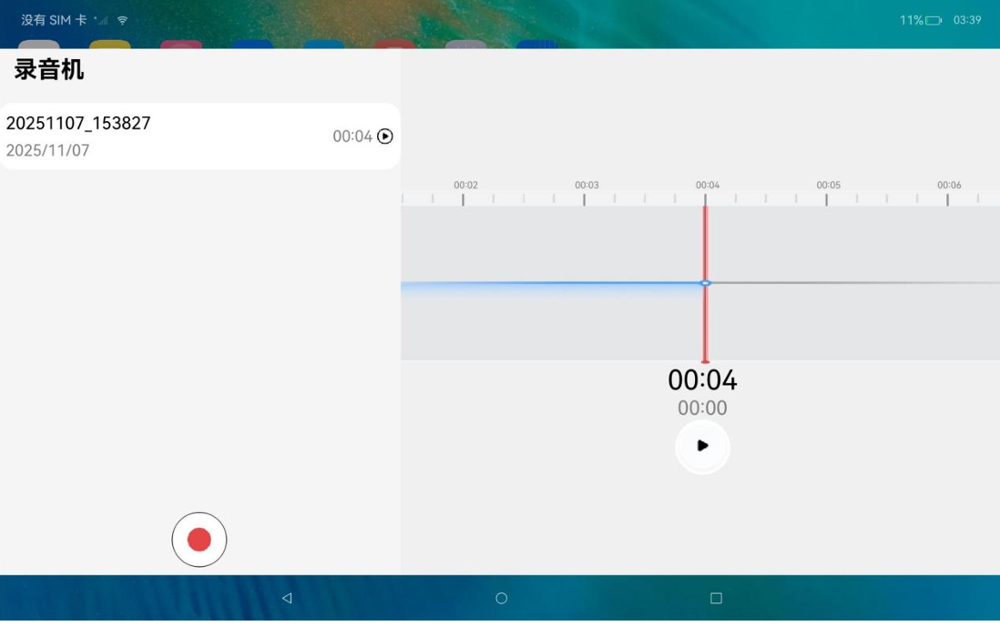

测试判断：

- 耳机播放的录音文件是否正常；

---

### 3.11 MIPI 相机测试

测试步骤：

1. 按照相机接口示意图连接 MIPI 相机；

2. 确认排线方向和接口连接正确；

   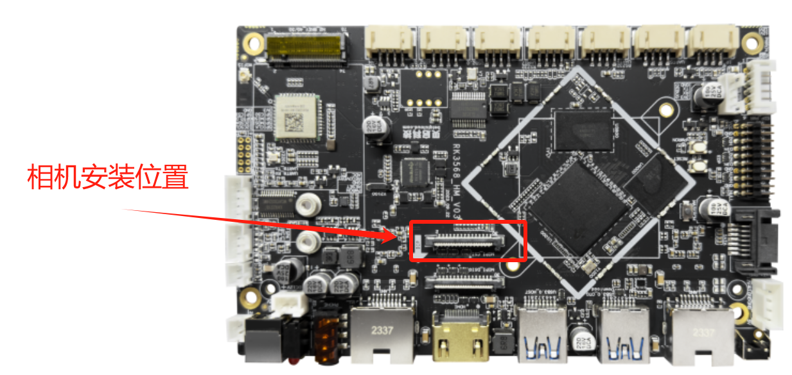

3. 打开系统相机 HAP；

4. 查看相机是否能够正常成像。

测试判断：

- 系统相机可以打开；
- 能够显示实时画面；
- 图像无明显异常；
- 相机功能正常。

如果无法成像，需要检查：

- MIPI 相机排线方向；
- 相机模组是否匹配；
- 相机应用权限或服务是否正常。

---

### 3.11 扬声器测试

测试步骤：

1. 找到标有SPK丝印处，插上喇叭进行测试

​	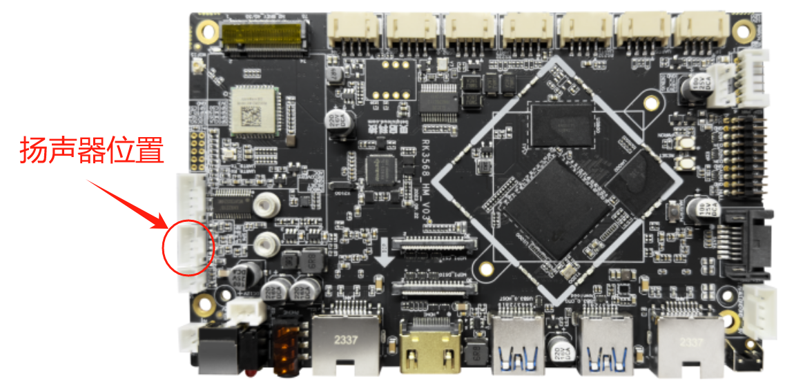

2. 打开系统桌面的音乐播放器，点击播放

测试判断：

- 扬声器是否发声，工作是否正常

***

