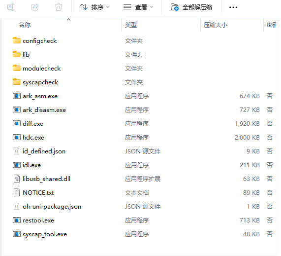
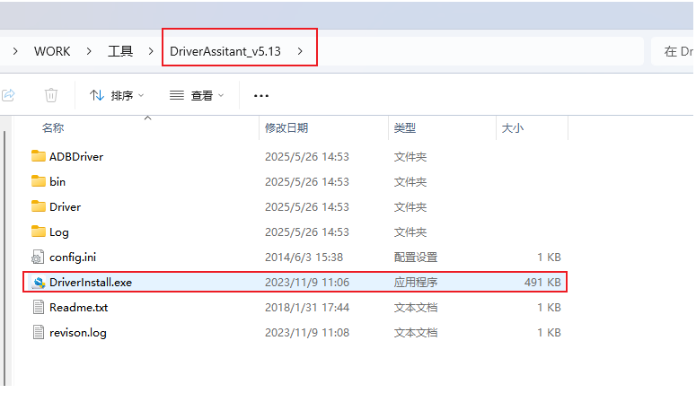
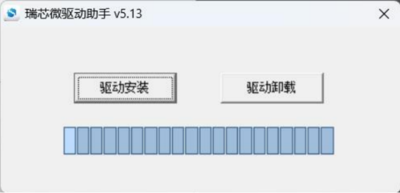
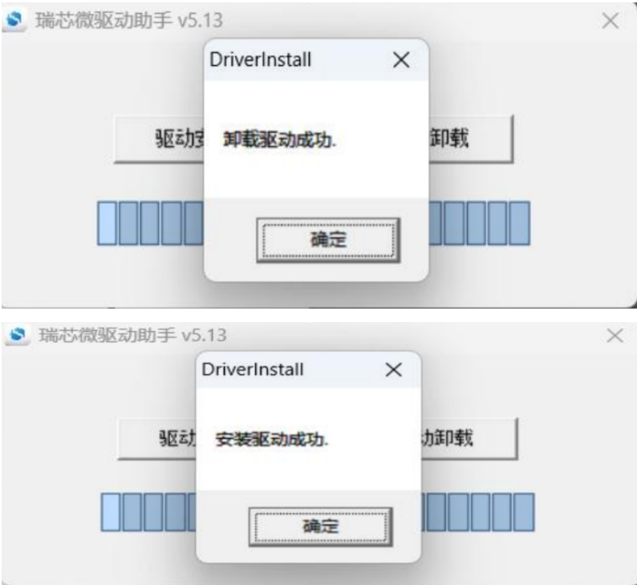
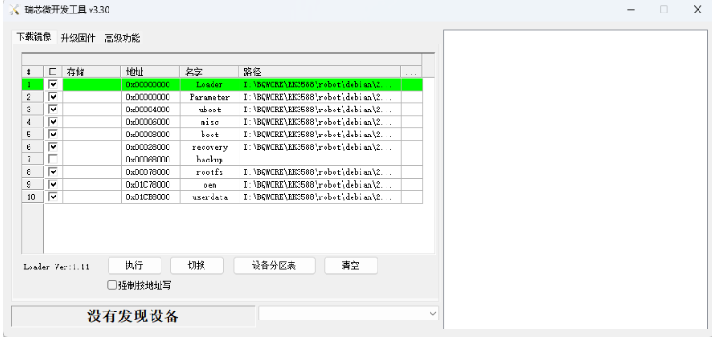

# 2. PC环境配置

我们会提供驱动安装包以及烧录工具包、以及烧录固件

下载方式：联系我们公司客服获取

下载完成后解压。

### 	2.1 ADB工具安装

hdc的工具在bin目录下，打开系统设置环境变量到该目录即可使用hdc工具。

### 	2.2 RockChip烧录驱动安装

为避免驱动安装出现问题，请先点击驱动卸载，再点击驱动安装，驱动成功安装后，如下所示

### 	2.3 RockChip烧录软件安装

解压后直接运行即可（最好解压到全英文路径下面）

