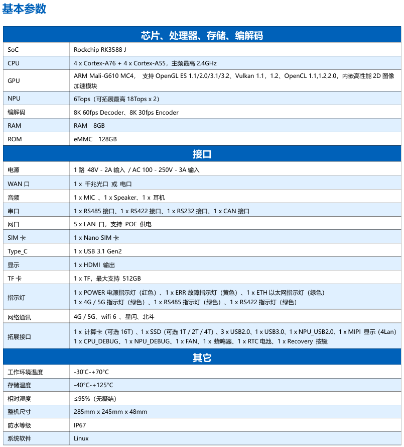
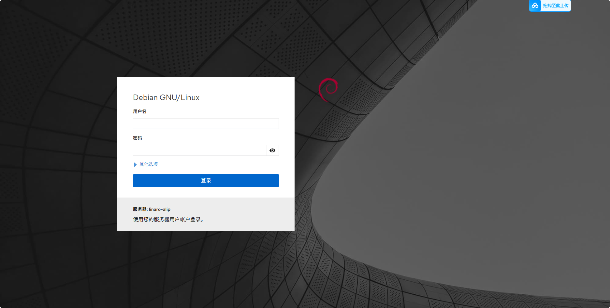
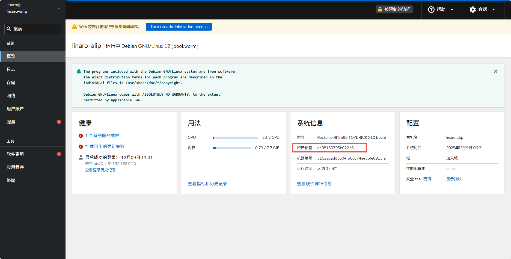
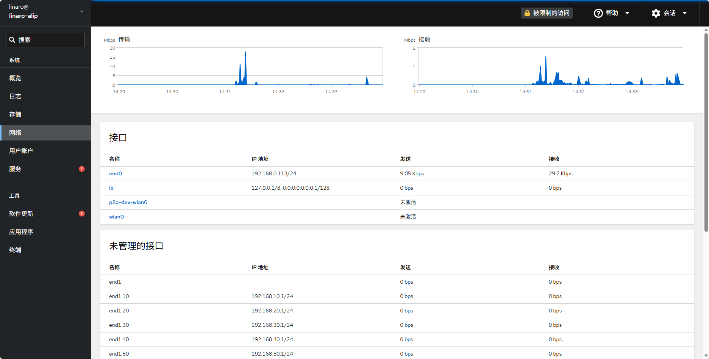
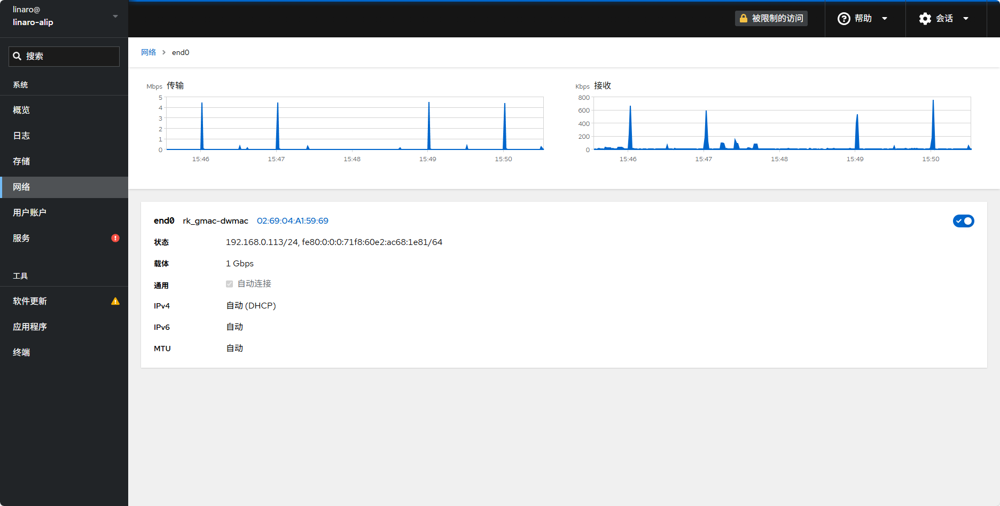
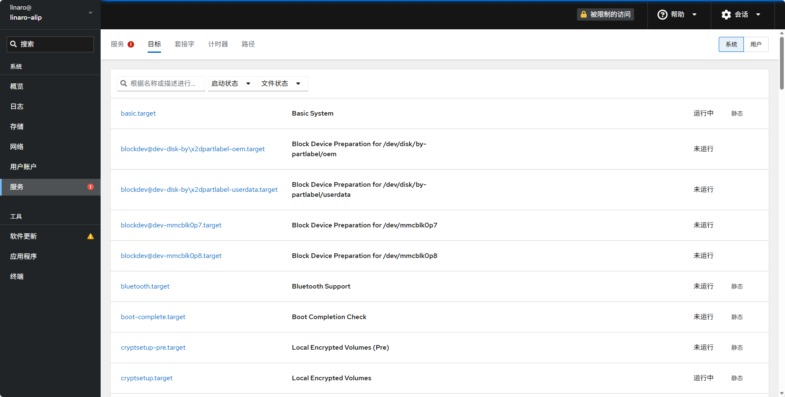
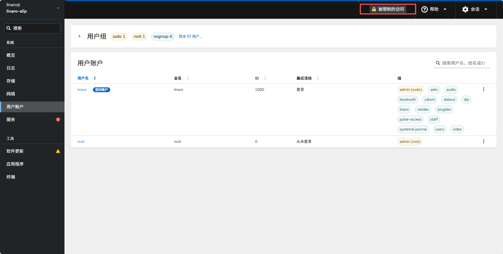
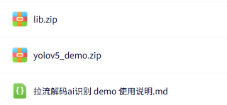

# 贝启AI边缘工作站

### 简介

​	贝启AI边缘工作站是一款面向边缘计算与工业智能的国产化AI工作站，采用瑞芯微旗舰 RK3588J芯片，6 TOPS NPU，支持8K@60fps硬解码与8K@30fps硬编码，算力、图像与多媒体性能全面拉满。
​	提供48V/AC100-250V宽压供电，5个千兆网口(POE)、千兆光口/电口、4G/5G+WiFi6+北斗+星闪全栈通信，以及RS485/RS422/RS232+CAN工业总线，满足复杂场景互联需求。拓展配置PCle计算卡(16T可选)与1个SSD插槽，支持大容量存储与AI加速卡即插即用。
​	整机具备-30°C至+70°C的宽温工作能力，防水等级达IP67，适应严苛工业环境。适用于智能安防、机器视觉、无人系统及物联网网关等高要求场景，是部署在边缘的高可靠AI解决方案。

## 一、 设备详情

**1、   贝启AI边缘工作站外观尺寸示意图**

​																									图1：   贝启AI边缘工作站外观尺寸示意图

**2、   贝启AI边缘工作站接口示意图**

​																									图2：   贝启AI边缘工作站接口示意图

**3、   贝启AI边缘工作站主板接口示意图**

​																									图3：   贝启AI边缘工作站主板接口示意图

**4、   贝启AI边缘工作站接口外设示意图**

​																									图4：   贝启AI边缘工作站接口外设示意图

**5、   贝启AI边缘工作站拓展RK1828计算卡**

​																							图5：   贝启AI边缘工作站拓展RK1828计算卡示意图

## 二、设备基本参数

​																										图6：   贝启AI边缘工作站基本参数图

## 三、设备管理

设备上总共有六个网口，其中一个为 wan 口（线缆上有相关标识），接交换机或者路由器，设备使用 wan 口进行上网；剩余五个网口为 lan 口，可以对外分配 IP，网段分别为 192.168.10.0/24，192.168.20.0/24，192.168.30.0/24，192.168.40.0/24，192.168.50.0/24，对应 lan1-lan5 五个网口，即 lan1 可以对外分配 192.168.10.0/24 地址段的 IP，lan2 可以对外分配 192.168.20.0/24 地址段的 IP...

设备 wan 口接到路由器或者交换机，成功获取到 IP 后(可通过 adb shell ifconfig 查看，需要使用 typec 线连接设备上的 typec 口与 pc)，可通过 ***IP:9090*** (IP 为 adb shell ifconfig 中 end0 网卡的 IP 地址)进行登录，登录页面如下

账号密码均为 linaro，登陆后，在概览界面中可以看到 sn 号，下图红框处的资产标签即为 sn

在网络界面中可以看到设备上的网卡，目前仅支持对 end0(即 wan 口)，与 wlan0 的配置

具体配置页面如下，页面上方为当前的流量图，下面可以配置固定 IP，网关等，其他网卡的配置，目前需要在左侧终端页中使用命令行进行配置

左侧服务页面中，可以对开机自启服务等进行配置，选择禁用或者启动服务，如下

用户账户页面可以对用户进行配置，例如新增用户，删除某个用户，修改某个用户的密码等操作，操作前需要先点击下图红框处接触限制，才可进行操作

## 四、设备相关例程

设备相关例程见[贝启AI工作站相关例程](https://pan.baidu.com/s/1QSvTuqrIjKQowduZ79q4oA?pwd=2rif)。

链接包含如下 demo

-    rtsp 拉流解码 demo
-    rtsp 推流 demo

用户可以根据链接内的说明来进行部署

此处对 demo 进行简单说明
rtsp 拉流解码 demo 包含如下内容，其中 lib.zip 包含运行需要的库；yolov5_demo.zip 包含可执行程序以及相关文件；拉流解码 ai 识别 demo 使用说明.md 则为 demo 详细使用说明

##### rtsp 拉流解码 demo 说明

流程如下

demo 使用 ffmpeg 拉取 rtsp 视频流，通过 rockit_vdec 模块进行解码， 使用 rknn 运行 yolov5 算法，使用 rga 模块进行结果绘制，最后送到 vo 进行显示

##### rtsp 推流 demo 说明

rtsp 拉流解码 demo 则是对应的推流 demo，能够快速实现推出相关 rtsp 流供  rtsp 拉流解码 demo 使用，流程如下

~~~mermaid
graph LR
file --> ffmpeg --> rtsp
~~~

demo 读取视频文件内容，根据视频信息创建 ffmpeg 相关上下文，最后推一个 rtsp 出来

客户可以通过这两个 demo 快速熟悉贝启AI工作站对于视频处理以及 npu 等相关能力
