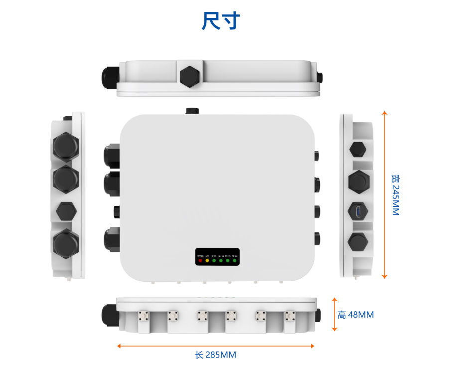
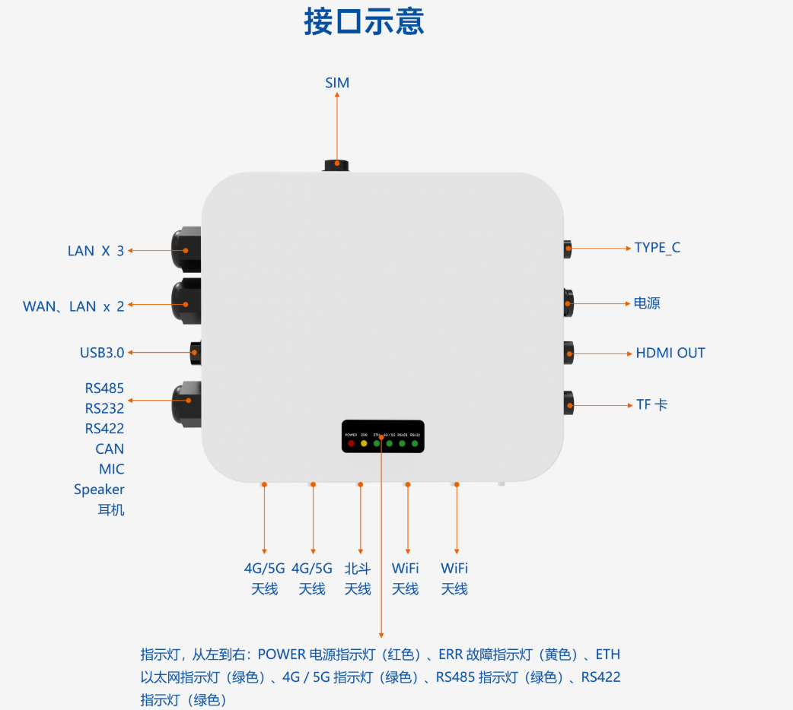
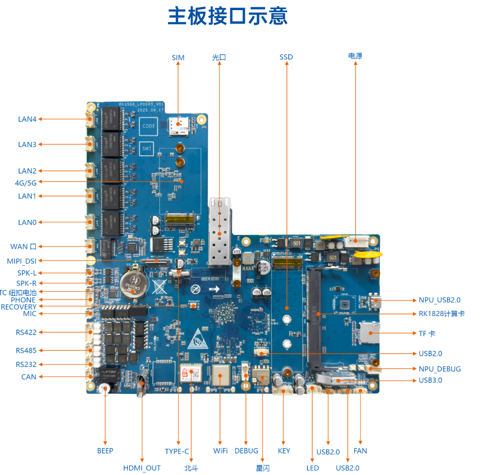
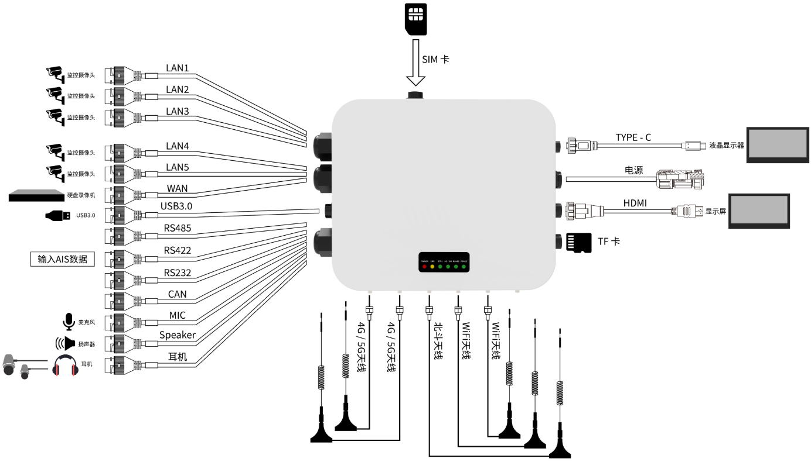
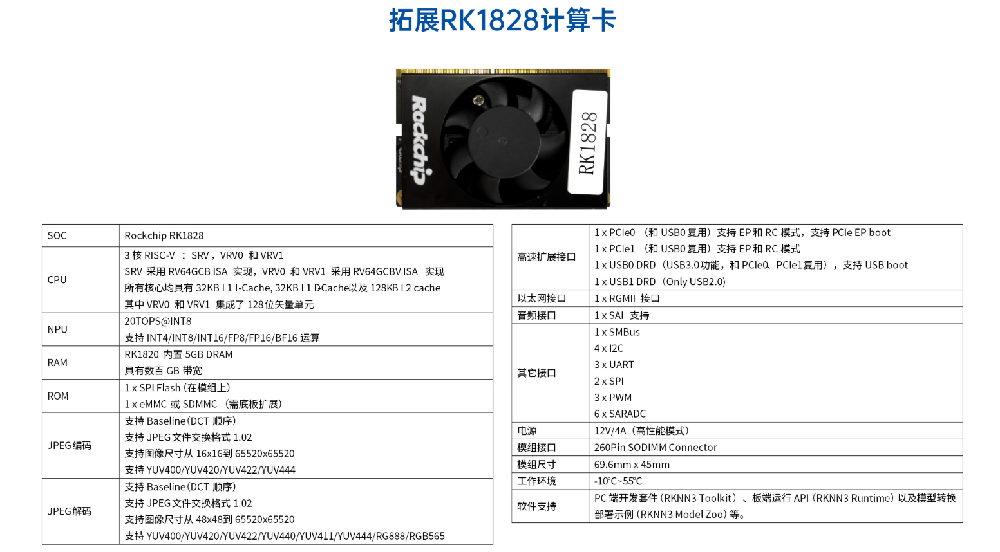

# 一、 设备详情

**1、   贝启AI边缘工作站外观尺寸示意图**

​																									图1：   贝启AI边缘工作站外观尺寸示意图

**2、   贝启AI边缘工作站接口示意图**

​																									图2：   贝启AI边缘工作站接口示意图

**3、   贝启AI边缘工作站主板接口示意图**

​																									图3：   贝启AI边缘工作站主板接口示意图

**4、   贝启AI边缘工作站接口外设示意图**

​																									图4：   贝启AI边缘工作站接口外设示意图

**5、   贝启AI边缘工作站拓展RK1828计算卡**

​																							图5：   贝启AI边缘工作站拓展RK1828计算卡示意图
