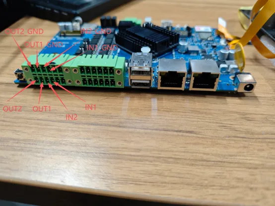

# 4. 基础功能验证

### 4.1 USB功能测试

插入U盘到USB-HOST，使用adb shell进入设备终端可以查看当前U盘是否被挂载

### 4.2 DIDO

IN1节点 /sys/devices/platform/gpios_dido/DIN1
IN2节点 /sys/devices/platform/gpios_dido/DIN2
OUT1节点 /sys/devices/platform/gpios_dido/DOUT1
OUT2节点 /sys/devices/platform/gpios_dido/DOUT2

OUT1与OUT2 echo 1为输出高电平，echo 0 为输出低电平
参考命令 echo 1 > /sys/devices/platform/gpios_dido/DOUT1

IN1与IN2使用cat查看输入，返回值为0为输入低电平，返回值为1为输入高电平
参考命令 cat /sys/devices/platform/gpios_dido/DIN1
