# RK3576 数据采集网关介绍

### 简介

RK3576数据采集网关是一款高扩展性且功能强大的数据采集网关，可对工业设备与智能设备进行实时监控与控制。搭载 RK3576 高性能处理器（8 核 CPU），内置 6 TOPs NPU，配备 4GB LPDDR4 运行内存与 32GB eMMC 固定存储。接口资源丰富，支持 RS-485、RS-232、CAN、DI/DO、HDMI OUT（4K@120Hz）、TYPE-C、千兆 LAN、SIM 卡槽、TF 卡槽及 3.5mm 音频接口。

## 一、 设备详情

1、接口示意

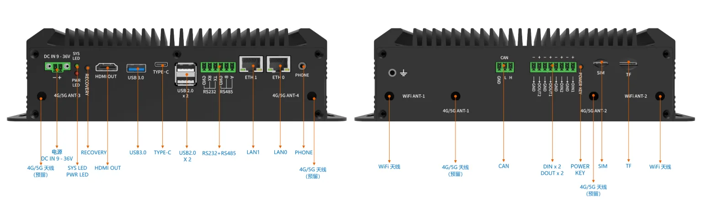

​																									图1：   RK3576 数据采集网关接口示意图

2、基本参数

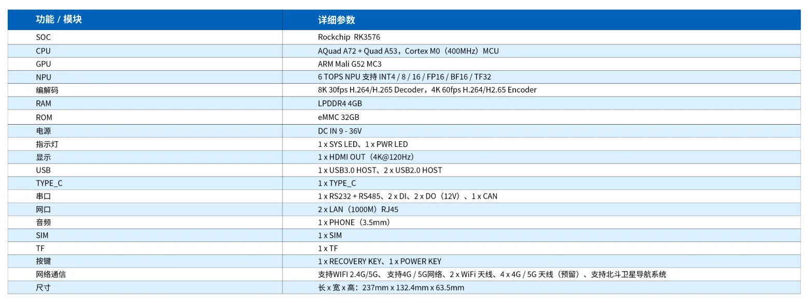

​																									图2：   RK3576 数据采集网关基本参数图

## 二、固件烧写

需要在 pc 上安装 rk 的驱动，驱动版本 5.12，步骤如下

1.   解压
2.   双击 DriverInstall.exe 打开
3.   为保证驱动正确安装，建议先点击驱动卸载，再进行驱动安装，界面如下

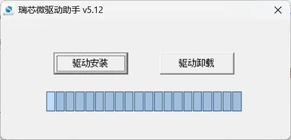


使用工具为 RKDevTool_Release_v3.28， 版本为 3.28，***需要在 windows10/11 上进行使用，该工具目前暂不支持其他系统***

若版本较低可能出现固件无法加载的情况

##### 固件烧写

1.   按住板子上的 recovery 键并重启，进入 loader 模式，或者在板子上电开机后，使用串口、ssh 或 adb 终端，输入 reboot loader 进行 loader 模式

2.   按上述步骤操作后，会显示 “发现一个 LOADER 设备”。右键单击工具空白处，点击导入配置，选择我们提供 parameter.txt，如下

      

     根据自己镜像的位置调整镜像路径，然后勾选要更新的 镜像，然后点击“执行”按钮进行升级。

## 三、设备接口使用说明

### 1.DI\DO

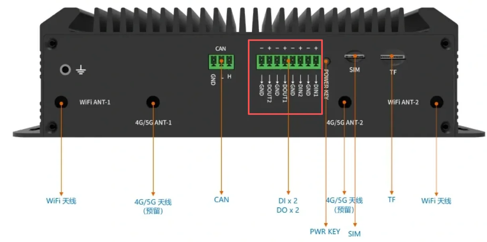

接口位置如上图红框，接线方式参照机身外壳丝印，将 DI1与 DO1，DI2 与 DO2 进行连接测试，可以使用凤凰头，也可以选择使用杜邦线直接进行连接，测试命令如下

```
cat /sys/bus/platform/drivers/gpios_in/gpios_dido/DIN1 #查看 DI1 的状态
echo 1/0 > /sys/bus/platform/drivers/gpios_in/gpios_dido/DOUT1 #拉高或拉低 DO1
#测试 DI2 与 DO2，将上述命令中 DIN1 修改 DIN2，DOUT1 修改为 DOUT2 即可
```

测试结果如下


### 2.type-c

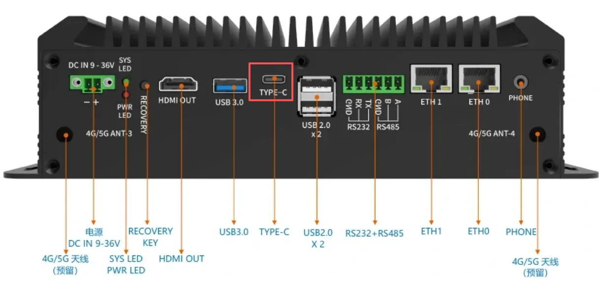

接口位置如上图，用户可以使用 typc-c 转 usb-a 线缆将主板与 pc 进行连接，连接后，可以使用 adb 命令进入主板终端来进行操作

### 3.rs485

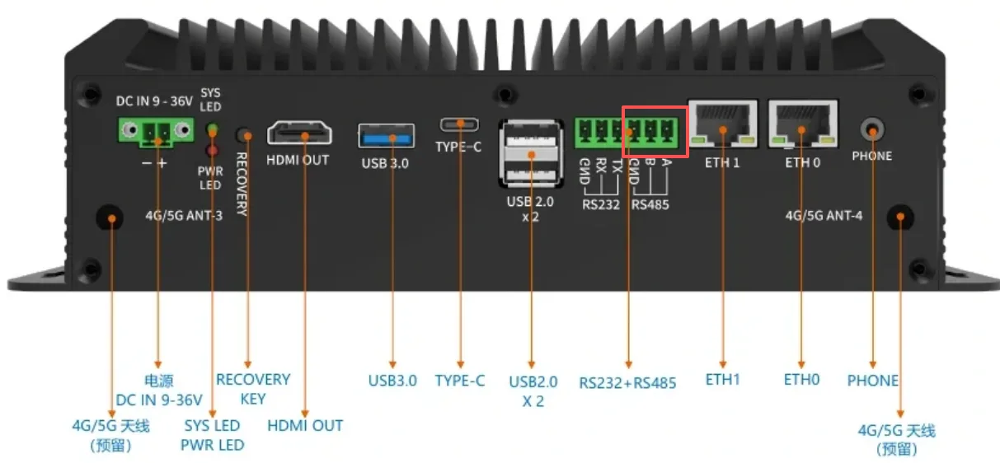

接口位置如上图，线序可在主板背面查看


```
#rs485 串口设备为 /dev/ttyS2
stty -F /dev/ttyS2 speed 115200 cs8 -parenb -cstopb -crtscts #设置波特率 115200 8位数据为 1位停止位 无校验
```

xcom 设置如下图所示

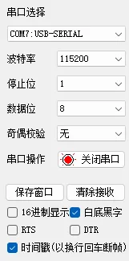

收发测试结果如下


### 4.rs232

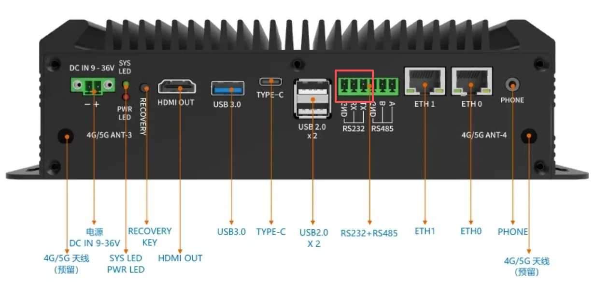

接口位置如上图，线序可在主板背面查看


```
#rs485 串口设备为 /dev/ttyS5
stty -F /dev/ttyS5 speed 115200 cs8 -parenb -cstopb -crtscts #设置波特率 115200 8位数据为 1位停止位 无校验
```

xcom 设置如下图所示

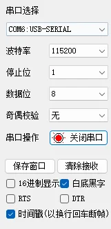

收发测试结果如下

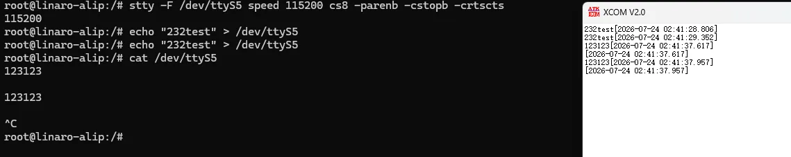

## 四、设备例程

设备相关例程[RK3576 数据采集网关例程](https://pan.baidu.com/s/1N3oW-I1l4EKugPtlbp7xCg?pwd=32d2)

链接包含如下 demo

-    rkllm demo

用户可以根据链接内的说明来进行部署

此处对 demo 进行简单说明
rkllm demo 包含如下内容

-   librkllmrt.so rkllm demo 所需运行库
-   llm_demo rkllm demo
-   qwen3576.rkllm 3576 千问 rkllm 模型
-   3576 运行通义千问大语言模型.pdf

librkllmrt.so 使用 adb 命令推送到板子 /usr/lib 目录，qwen3576.rkllm 和 llm_demo推送到板子 /data 目录，命令如下，其中的path需要根据实际修改

```
adb push path/librkllmrt.so /usr/lib
adb push path/qwen3576.rkllm /data
adb push path/llm_demo /data
```

demo 运行前需要修改文件系统句柄上限，命令如下

```
ulimit -n 4096
```

使用如下命令运行 llm_demo

```
/data/llm_demo qwen3576.rkllm
```

出现下列日志即可开始提问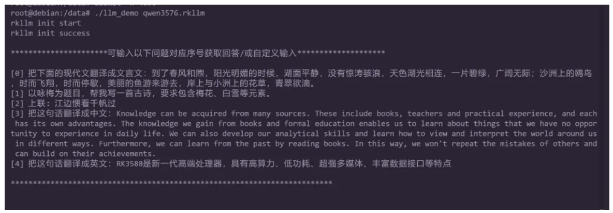

客户可以通过这个 demo 快速熟悉RK3576 数据采集网关的 npu 等相关能力
