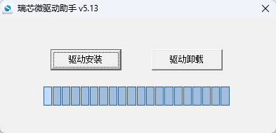
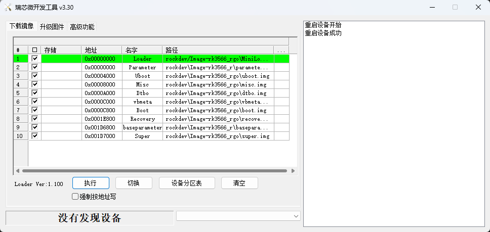
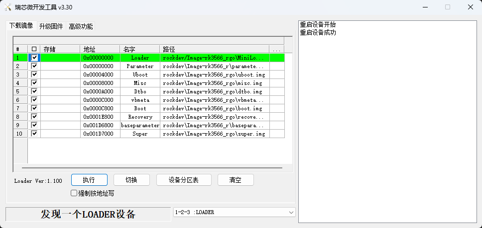
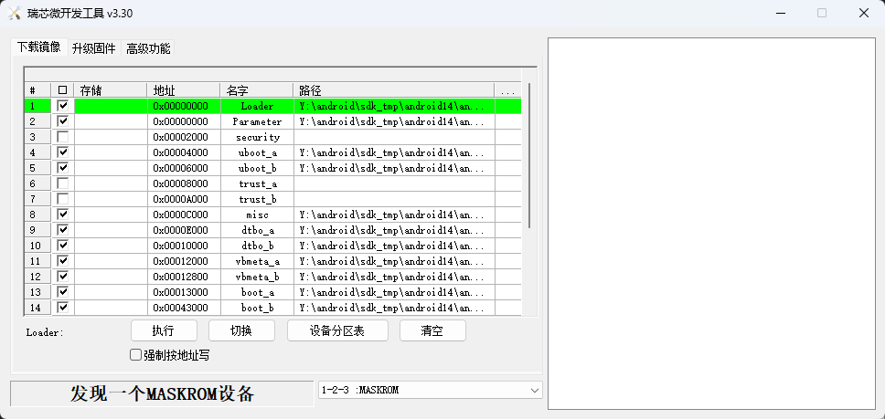
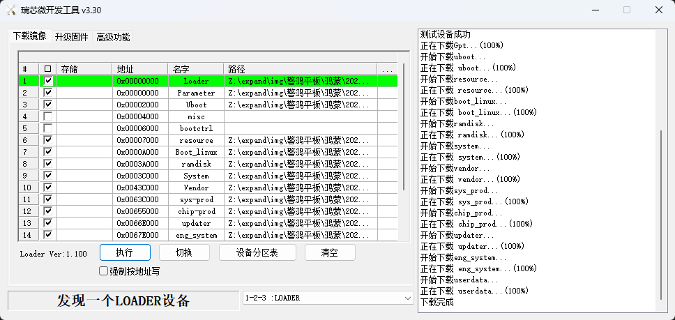
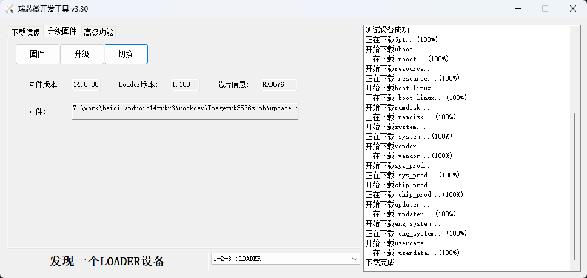

# 10.6英寸平板

## 一、快速上手

### 产品优势

1. 搭载OpenHarmony开源鸿蒙系统
2. 面向AIoT与行业应用的定位
3. 瑞芯微高性能芯片平台支撑
4. 专业的技术支持与服务

### 产品规格书

https://www.bearkey.com.cn/product/106%E8%8B%B1%E5%AF%B8%E5%B9%B3%E6%9D%BF.html?type=OpenHarmony&name=10.6%E8%8B%B1%E5%AF%B8%E5%B9%B3%E6%9D%BF&id=31

### 固件烧写

采用Loader模式烧写固件，如果无法进入loader烧写模式，仍可以进入 MaskRom 模式来烧写固件。

#### 进入烧写模式

#### 准备程序

10.6英寸平板

电脑主机

Type-C 数据线

#### 安装Windows RK USB驱动程序

先从网盘下载 DriverAssitant_v5.13.zip 至电脑上，解压目录运行里面的 DriverInstall.exe 。先选择驱动卸载，然后再选择驱动安装。

#### 进入loader烧写模式

1.Type-C数据一端接在平板上，另一端接到电脑PC端的USB接口上。

2.鸿蒙系统执hdc_std.exe shell 'reboot loader'，Android 系统执行 adb shell 'reboot loader'

#### 进入maskrom烧写模式

1.需要使用镊子先短接Maskrom触点

2.再短接reset触点2s后松开

3.最后再松开Maskrom触点

### 查询烧写状态

##### Windows主机查询

下载网盘 RKDevTool_v3.30_for_window.zip 工具至电脑上。双击打开RKDevTool_v3.30_for_window目录下的 RKDevTool.exe

没有发现设备（如下图所示）：表示开发板未进入烧写模式。

发现一个LOADER设备（如下图所示）：表示开发板进入loader烧写模式。

发现一个MASKROM设备（如下图所示）：表示开发板进入maskrom烧写模式。

### Windows主机烧写镜像

双击打开RKDevTool_v3.30_for_window目录下的RKDevTool.exe。

确认平板已经进入loader或者maskrom烧写模式。

打勾选择需要烧写的镜像。

鸿蒙固件需要烧写散包固件，如下图所示

Android固件可以烧写整包，如下图所示

点击“执行”按钮，开始烧写固件

## 二、Android开发

### Windows下的 ADB 安装

1、从 [https://adbdownload.com/ ](https://adbdownload.com/) 下载platform-tools-latest-windows.zip，

2、解压到C:\adb

3、设置环境变量

4、打开命令行窗口，输入：adb shell

如果一切正常，就可以进入adb shell，在设备上面运行命令。

#### 连接方式

通过type c线直连

1、列出所有连接设备及其序列号adb devices

List of devices attach

G1XXI2YZXK      device

G2XXI2YZXK      device

2、连接其中一台设备

adb  –s  G1XXI2YZXK   shell（如果仅有一台设备连接，直接adb shell）
通过网络连接

1、在设备串口上输入：

setprop service.adb.tcp.port 5555

stop adbd

start adbd

2、在设备串口上输入ip a，获取设备地址（172.16.9.76）

3、在主机上输入adb connect 172.16.9.76

4、在主机上输入adb  shell

#### 安装/卸载apk

1、adb install  [选项] *.apk

可带如下参数：

-l: forward lock application

-r: replace existing application

-t: allow test packages

-s: install application on sdcard

-d: allow version code downgrade

2、 adb uninstall *.apk

#### 其它adb 命令

请用adb –help获取对应帮助

## 三、常见问题

### FAQs

Todo

&gt; 可通过beiqi@beiqicloud.com联系我们!
